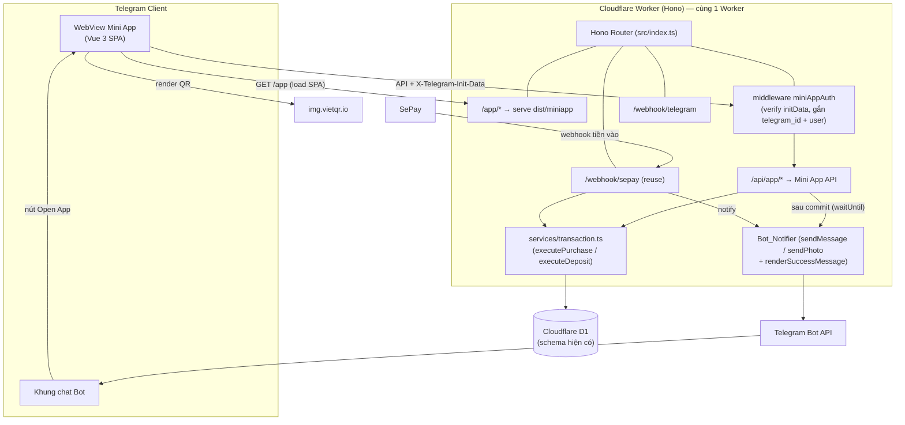
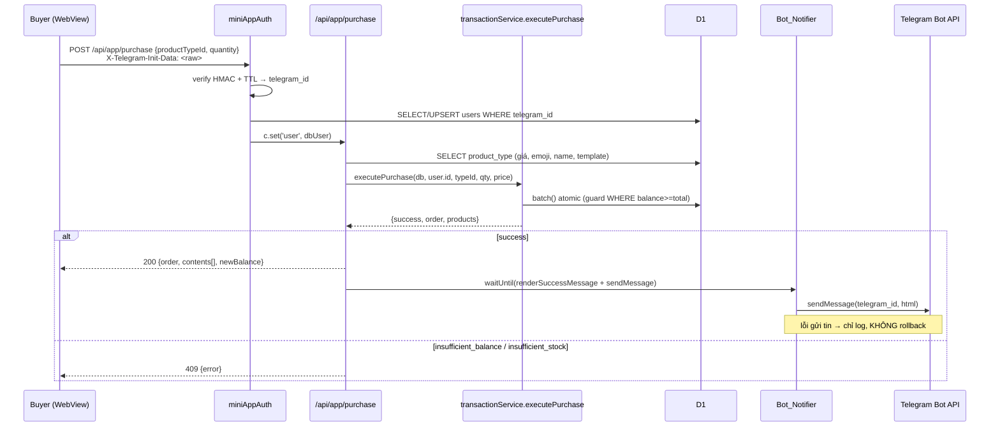
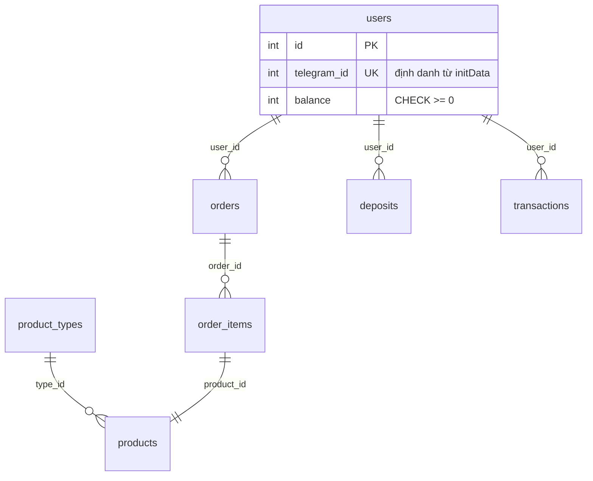
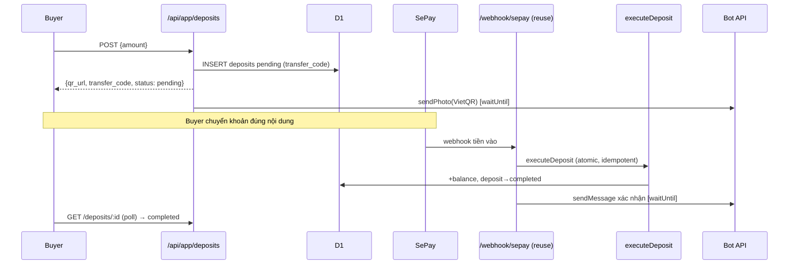

# Design Document — Telegram Mini App

## Overview

Telegram Mini App (gọi tắt **Mini App**) là một SPA Vue 3 + Vite + Tailwind nằm trong thư mục `miniapp/`, build ra `dist/miniapp`, và được phục vụ qua route `/app` trong **cùng Cloudflare Worker hiện tại** (Hono + D1). Mini App phục vụ trọn vẹn luồng người mua: xem số dư, duyệt danh mục, mua tài khoản số, nạp tiền qua VietQR/SePay, xem lịch sử đơn hàng và thông tin tài khoản.

Nguyên tắc thiết kế cốt lõi (bám sát requirements + AGENTS.md):

- **Tái sử dụng tối đa, KHÔNG viết lại logic nghiệp vụ đã có.** API Mini App là một lớp HTTP mỏng (controller) gọi thẳng vào các service/util hiện hữu: `transactionService.executePurchase` / `executeDeposit`, `renderSuccessMessage`, `sendMessage` / `sendPhoto`, `generateTransferCode`, `generateVietQRUrl`, `formatCurrency`. SePay vẫn cộng tiền qua `/webhook/sepay` hiện tại (không đổi).
- **Stateless auth bằng Telegram `initData`** — không phát hành JWT/phiên riêng (Req 1.7). Mỗi request đính kèm `initData` thô trong header `X-Telegram-Init-Data`, xác thực HMAC-SHA256 bằng Web Crypto trên từng request.
- **Bất biến hệ thống được giữ nguyên**: giao dịch atomic bằng D1 `batch()` + concurrency guard `WHERE balance >= total`, số dư không âm (CHECK constraint), idempotency SePay theo `sepay_transaction_id`.
- **`telegram_id` ≠ `users.id`**: mọi truy vấn người mua đều JOIN/lọc qua cột `telegram_id` rồi mới lấy `users.id` nội bộ (Req 1.6, AGENTS.md).
- **Đồng bộ tin nhắn bot**: mọi giao dịch trên Mini App gửi tin nhắn qua Bot API giống hệt flow bot; tin nhắn gửi **sau khi commit**; lỗi gửi tin **không rollback**, chỉ log (Req 7.5, 10.4).
- **UI iOS HIG + liquid glass, KHÔNG gradient** (Req 13).

### Phạm vi & ranh giới

| Trong phạm vi | Ngoài phạm vi |
|---|---|
| Route `/app` serve SPA Mini App | Hệ thống admin (CMS giữ nguyên ở `/cms`) |
| API nghiệp vụ mới dưới prefix `/api/app/*` | Thay đổi schema nghiệp vụ hiện có (Req 16.4) |
| Middleware `miniAppAuth` verify initData | Phát hành JWT/session cho Mini App (Req 1.7) |
| Gửi tin nhắn bot đồng bộ (reuse Bot_Notifier) | Thay đổi `/webhook/sepay` (chỉ tái sử dụng) |

## Architecture

### Sơ đồ thành phần & luồng request



### Luồng tuần tự — Mua hàng trên Mini App



### Tích hợp vào Worker hiện tại

Trong `src/index.ts`, thêm route mới **trước** 404 fallback, giữ nguyên thứ tự các route hiện có:

```ts
// Static assets cho Mini App SPA (route mới)
app.route('/app', miniAppStatic)

// Mini App business API (verify initData per-request)
app.route('/api/app', miniAppApi)
```

`/cms` và `/api/admin` giữ nguyên. Mini App **không** đụng vào webhook bot/SePay ngoài việc dùng chung service.

## Auth / initData Verification

### Thuật toán (chuẩn Telegram WebApp)

Telegram WebApp ký `initData` theo 2 bước HMAC-SHA256:

1. `secret_key = HMAC_SHA256(key = "WebAppData", message = bot_token)`
2. `computed_hash = HMAC_SHA256(key = secret_key, message = data_check_string)`
3. So sánh `computed_hash` (hex) với trường `hash` tách ra từ `initData`.

`data_check_string` = nối tất cả cặp `key=value` (trừ `hash`), **sắp xếp key tăng dần theo alphabet**, ngăn cách bằng ký tự `\n`.

> Lưu ý low-level: thứ tự HMAC ở bước 1 là `key="WebAppData"`, `message=bot_token` (khác với verify login widget cũ). Phải dùng đúng để hash khớp.

### Low-level: verify bằng Web Crypto

```ts
// src/utils/telegram-initdata.ts

export interface InitDataParsed {
  telegramId: number
  username: string | null
  firstName: string | null
  authDate: number // epoch seconds
  raw: string
}

const encoder = new TextEncoder()

async function hmacSha256(keyBytes: ArrayBuffer | Uint8Array, message: string): Promise<ArrayBuffer> {
  const key = await crypto.subtle.importKey(
    'raw',
    keyBytes,
    { name: 'HMAC', hash: 'SHA-256' },
    false,
    ['sign']
  )
  return crypto.subtle.sign('HMAC', key, encoder.encode(message))
}

function toHex(buf: ArrayBuffer): string {
  return [...new Uint8Array(buf)].map((b) => b.toString(16).padStart(2, '0')).join('')
}

/** So sánh hằng thời gian để tránh timing attack. */
function timingSafeEqualHex(a: string, b: string): boolean {
  if (a.length !== b.length) return false
  let diff = 0
  for (let i = 0; i < a.length; i++) diff |= a.charCodeAt(i) ^ b.charCodeAt(i)
  return diff === 0
}

/**
 * Xác thực initData theo chuẩn Telegram WebApp.
 * @returns InitDataParsed nếu hợp lệ, hoặc null nếu sai hash / thiếu trường.
 *   Việc kiểm tra TTL được tách riêng (xem verifyTtl) để trả lỗi đúng ngữ nghĩa.
 */
export async function verifyInitData(
  rawInitData: string,
  botToken: string
): Promise<InitDataParsed | null> {
  const params = new URLSearchParams(rawInitData)
  const hash = params.get('hash')
  if (!hash) return null

  // data_check_string: bỏ hash, sort key, nối "key=value" bằng \n
  const pairs: string[] = []
  for (const [k, v] of params.entries()) {
    if (k === 'hash') continue
    pairs.push(`${k}=${v}`)
  }
  pairs.sort()
  const dataCheckString = pairs.join('\n')

  // Bước 1: secret_key = HMAC_SHA256("WebAppData", bot_token)
  const secretKey = await hmacSha256(encoder.encode('WebAppData'), botToken)
  // Bước 2: computed = HMAC_SHA256(secret_key, data_check_string)
  const computed = toHex(await hmacSha256(secretKey, dataCheckString))

  if (!timingSafeEqualHex(computed, hash)) return null

  const authDate = Number(params.get('auth_date'))
  if (!authDate || Number.isNaN(authDate)) return null

  const userJson = params.get('user')
  if (!userJson) return null
  let user: { id: number; username?: string; first_name?: string }
  try {
    user = JSON.parse(userJson)
  } catch {
    return null
  }
  if (!user?.id) return null

  return {
    telegramId: user.id,
    username: user.username ?? null,
    firstName: user.first_name ?? null,
    authDate,
    raw: rawInitData,
  }
}

/** Kiểm tra TTL sau khi hash đã hợp lệ (Req 2.2, 2.4). */
export function isInitDataFresh(authDate: number, ttlSeconds: number, nowSeconds: number): boolean {
  return nowSeconds - authDate <= ttlSeconds && nowSeconds >= authDate
}
```

### Middleware `miniAppAuth`

Gắn `telegram_id` + bản ghi `users` vào context. Tự tạo user mới theo đúng quy tắc `/start` (Req 3).

```ts
// src/middleware/miniapp-auth.ts
import { createMiddleware } from 'hono/factory'
import type { Bindings } from '../types'
import type { DbUser } from '../types/db'
import { verifyInitData, isInitDataFresh } from '../utils/telegram-initdata'

const INIT_DATA_TTL_SECONDS = 3600 // 1 giờ

export type MiniAppVariables = {
  telegramId: number
  user: DbUser
}

export const miniAppAuth = createMiddleware<{
  Bindings: Bindings
  Variables: MiniAppVariables
}>(async (c, next) => {
  const raw = c.req.header('X-Telegram-Init-Data')
  if (!raw) return c.json({ success: false, data: null, error: 'Missing initData' }, 401) // Req 1.3

  const parsed = await verifyInitData(raw, c.env.BOT_TOKEN)
  if (!parsed) return c.json({ success: false, data: null, error: 'Invalid initData' }, 401) // Req 1.4, 2.3

  const now = Math.floor(Date.now() / 1000)
  if (!isInitDataFresh(parsed.authDate, INIT_DATA_TTL_SECONDS, now)) {
    return c.json({ success: false, data: null, error: 'initData expired' }, 401) // Req 2.2
  }

  // Upsert user theo telegram_id (Req 3) — tái dùng quy tắc /start
  const user = await getOrCreateUser(c.env.DB, parsed)

  c.set('telegramId', parsed.telegramId)
  c.set('user', user)
  await next()
})
```

```ts
/**
 * Lấy user theo telegram_id; nếu chưa có → tạo mới balance=0 (Req 3.1, 3.2).
 * Dùng INSERT ... ON CONFLICT(telegram_id) để idempotent dưới đồng thời (Req 3.3).
 * Cùng quy tắc khởi tạo với flow /start (src/bot/commands/start.ts).
 */
export async function getOrCreateUser(db: D1Database, p: InitDataParsed): Promise<DbUser> {
  const now = new Date().toISOString()
  await db
    .prepare(
      `INSERT INTO users (telegram_id, username, first_name, balance, is_active, last_interaction_at, created_at, updated_at)
       VALUES (?, ?, ?, 0, 1, ?, ?, ?)
       ON CONFLICT(telegram_id) DO UPDATE SET
         username = excluded.username,
         first_name = excluded.first_name,
         last_interaction_at = excluded.last_interaction_at,
         updated_at = excluded.updated_at`
    )
    .bind(p.telegramId, p.username, p.firstName, now, now, now)
    .run()

  return db
    .prepare('SELECT * FROM users WHERE telegram_id = ?')
    .bind(p.telegramId)
    .first<DbUser>() as Promise<DbUser>
}
```

> `users.telegram_id` đã có ràng buộc `UNIQUE` (migration 0001) nên `ON CONFLICT(telegram_id)` là an toàn và idempotent, tránh tạo bản ghi trùng khi nhiều request đến đồng thời (Req 3.3).

## Components and Interfaces

### API Endpoints — Mini App

### Quy ước chung

- **Prefix**: tất cả dưới `/api/app/*`, đăng ký `miniAppApi.use('/*', miniAppAuth)` nên **mọi** endpoint đều yêu cầu `X-Telegram-Init-Data` hợp lệ.
- **Response shape**: tái dùng `ApiResponse<T>` hiện có — `{ success, data, error, meta? }` (`src/types/api.ts`).
- **Định danh người mua**: lấy từ `c.get('user')` (đã JOIN qua `telegram_id`); controller dùng `user.id` cho service, KHÔNG nhận `user_id` từ client (chống IDOR).
- **Mã lỗi chuẩn**:

| HTTP | Khi nào | error |
|---|---|---|
| 200 | Thành công | `null` |
| 400 | Input sai (quantity ≤ 0, amount ngoài khoảng) | `"validation_error"` / message cụ thể |
| 401 | Thiếu/sai initData hoặc hết TTL | `"unauthorized"` |
| 403 | Truy cập tài nguyên không thuộc sở hữu (đơn người khác) | `"forbidden"` |
| 404 | Không tìm thấy product_type/order | `"not_found"` |
| 409 | Số dư không đủ / hết hàng / out_of_stock | `"insufficient_balance"` / `"insufficient_stock"` |
| 429 | Vượt rate limit (double-tap mua/nạp) | `"rate_limited"` |
| 500 | Lỗi DB | `"db_error"` |

### Danh sách endpoint

| # | Method | Path | Mục đích | Reuse |
|---|---|---|---|---|
| 1 | GET | `/api/app/me` | Thông tin tài khoản + số dư | `c.get('user')` |
| 2 | GET | `/api/app/home` | Số dư + tóm tắt trang chủ | users theo telegram_id |
| 3 | GET | `/api/app/product-types` | Danh sách loại sản phẩm + tồn kho | query giống `handleCategoryList` |
| 4 | GET | `/api/app/product-types/:id` | Chi tiết loại sản phẩm | query giống `handleCategoryDetail` |
| 5 | POST | `/api/app/purchase` | Mua hàng atomic | `transactionService.executePurchase` + `renderSuccessMessage` + `sendMessage` |
| 6 | POST | `/api/app/deposits` | Tạo yêu cầu nạp + VietQR | `generateTransferCode` + `generateVietQRUrl` + `sendPhoto` |
| 7 | GET | `/api/app/deposits/:id` | Trạng thái yêu cầu nạp | query deposits theo user.id |
| 8 | GET | `/api/app/orders` | Lịch sử đơn hàng | query orders theo user.id |
| 9 | GET | `/api/app/orders/:id` | Chi tiết đơn + nội dung products | query có guard owner |

---

#### 1. `GET /api/app/me` — Thông tin tài khoản (Req 12)

Request: chỉ header initData.

Response 200:
```json
{
  "success": true,
  "data": {
    "telegram_id": 123456789,
    "username": "buyer1",
    "first_name": "An",
    "balance": 150000,
    "balance_display": "150,000đ"
  },
  "error": null
}
```
- KHÔNG trả bất kỳ field admin nào (Req 12.3). `balance_display` format bằng `formatCurrency` để đồng bộ định dạng (Req 4.2).

#### 2. `GET /api/app/home` — Trang chủ (Req 4)

Response 200:
```json
{
  "success": true,
  "data": {
    "balance": 150000,
    "balance_display": "150,000đ",
    "shortcuts": ["shop", "deposit", "history", "account"]
  },
  "error": null
}
```
- Số dư lấy từ `users` theo `telegram_id` (Req 4.1). Lối tắt do frontend điều hướng (Req 4.3, 4.4).

#### 3. `GET /api/app/product-types` — Danh mục (Req 5.1, 5.2)

Trả về các `product_types` có `is_visible = 1`, kèm tồn kho `available`, sắp xếp `sort_order`. **Bao gồm cả loại hết hàng** (`stock = 0`) để frontend hiển thị trạng thái hết hàng + disable mua (Req 5.4) — khác query bot vốn `HAVING stock > 0`.

```sql
SELECT pt.id, pt.name, pt.emoji, pt.price, pt.sort_order,
       COUNT(CASE WHEN p.status = 'available' THEN 1 END) AS stock
FROM product_types pt
LEFT JOIN products p ON p.type_id = pt.id
WHERE pt.is_visible = 1
GROUP BY pt.id
ORDER BY pt.sort_order ASC, pt.name ASC;
```

Response 200:
```json
{
  "success": true,
  "data": [
    { "id": 1, "name": "Netflix", "emoji": "🎬", "price": 50000, "price_display": "50,000đ", "stock": 12, "in_stock": true },
    { "id": 2, "name": "Spotify", "emoji": "🎵", "price": 30000, "price_display": "30,000đ", "stock": 0, "in_stock": false }
  ],
  "error": null
}
```

#### 4. `GET /api/app/product-types/:id` — Chi tiết (Req 5.3, 5.4)

Response 200:
```json
{
  "success": true,
  "data": {
    "id": 1, "name": "Netflix", "emoji": "🎬",
    "description": "Tài khoản xem phim 1 tháng",
    "price": 50000, "price_display": "50,000đ",
    "stock": 12, "in_stock": true, "max_quantity": 50
  },
  "error": null
}
```
- 404 nếu `id` không tồn tại hoặc `is_visible = 0`. `description`, `price`, `stock` đúng Req 5.3. KHÔNG trả `success_template` (chỉ dùng server-side).

#### 5. `POST /api/app/purchase` — Mua hàng (Req 6, 7, 15.3)

Request:
```json
{ "productTypeId": 1, "quantity": 2 }
```

Xử lý (controller — KHÔNG viết lại logic atomic):
```ts
miniAppApi.post('/purchase', async (c) => {
  const user = c.get('user')
  const { productTypeId, quantity } = await c.req.json()

  // Validate input (Req 6.1)
  if (!Number.isInteger(quantity) || quantity <= 0 || quantity > 50) {
    return c.json({ success: false, data: null, error: 'validation_error' }, 400)
  }

  // Rate-limit double-tap (reuse consumeToken/PURCHASE_RULE từ bot/rate-limit)
  const verdict = consumeToken(`app:buy:${user.telegram_id}`, PURCHASE_RULE)
  if (!verdict.allowed) return c.json({ success: false, data: null, error: 'rate_limited' }, 429)

  const pt = await c.env.DB.prepare(
    'SELECT * FROM product_types WHERE id = ? AND is_visible = 1'
  ).bind(productTypeId).first<DbProductType>()
  if (!pt) return c.json({ success: false, data: null, error: 'not_found' }, 404)

  // Tổng tiền = giá × số lượng (Req 6.1) — tính server-side, KHÔNG tin client
  const totalAmount = pt.price * quantity

  // Giao dịch atomic (Req 6.2..6.5) — reuse nguyên service
  const result = await transactionService.executePurchase(
    c.env.DB, user.id, pt.id, quantity, pt.price
  )

  if (!result.success) {
    const map = { insufficient_balance: 409, insufficient_stock: 409, db_error: 500 } as const
    return c.json({ success: false, data: null, error: result.error }, map[result.error!] ?? 500)
  }

  const products = result.products ?? []
  const balanceAfter = user.balance - totalAmount

  // Đồng bộ bot SAU commit (Req 7) — fire-and-forget, lỗi không rollback (Req 7.5)
  const html = renderSuccessMessage(pt.success_template, {
    emoji: pt.emoji, name: pt.name, quantity,
    totalAmount, balanceAfter, contents: products.map((p) => p.content),
  })
  const notify = sendMessage(c.env.BOT_TOKEN, user.telegram_id, html, { parse_mode: 'HTML' })
    .catch((err) => console.error('[MiniApp] notify purchase failed:', err))
  c.executionCtx?.waitUntil?.(notify)

  // Trả nội dung tài khoản + số dư cho app (Req 6.6, 6.7)
  return c.json({
    success: true,
    data: {
      order_id: result.order?.id,
      quantity,
      total_amount: totalAmount,
      new_balance: balanceAfter,
      new_balance_display: formatCurrency(balanceAfter),
      contents: products.map((p) => p.content),
    },
    error: null,
  })
})
```

Response 200 (thành công):
```json
{
  "success": true,
  "data": {
    "order_id": 42, "quantity": 2, "total_amount": 100000,
    "new_balance": 50000, "new_balance_display": "50,000đ",
    "contents": ["user1:pass1", "user2:pass2"]
  },
  "error": null
}
```
Response 409: `{ "success": false, "data": null, "error": "insufficient_balance" }` — số dư & tồn kho giữ nguyên (Req 6.3, 6.4).

#### 6. `POST /api/app/deposits` — Tạo yêu cầu nạp (Req 8, 10.1)

Request:
```json
{ "amount": 100000 }
```

Xử lý:
```ts
miniAppApi.post('/deposits', async (c) => {
  const user = c.get('user')
  const { amount } = await c.req.json()

  // Đọc min/max từ system_config (Req 8.2)
  const cfg = await readDepositLimits(c.env.DB) // { min, max }
  if (!Number.isInteger(amount) || amount < cfg.min || amount > cfg.max) {
    return c.json({
      success: false, data: null,
      error: `Số tiền nạp phải từ ${formatCurrency(cfg.min)} đến ${formatCurrency(cfg.max)}`,
    }, 400)
  }

  // Rate-limit (reuse DEPOSIT_RULE)
  const verdict = consumeToken(`app:dep:${user.telegram_id}`, DEPOSIT_RULE)
  if (!verdict.allowed) return c.json({ success: false, data: null, error: 'rate_limited' }, 429)

  // Huỷ pending cũ + tạo deposit mới (giống handleDepositAmount)
  await c.env.DB.prepare(
    "UPDATE deposits SET status='cancelled' WHERE user_id=? AND status='pending'"
  ).bind(user.id).run()

  const transferCode = generateTransferCode(user.telegram_id) // reuse util
  const now = new Date().toISOString()
  const inserted = await c.env.DB.prepare(
    "INSERT INTO deposits (user_id, transfer_code, amount, status, created_at) VALUES (?, ?, ?, 'pending', ?) RETURNING id"
  ).bind(user.id, transferCode, amount, now).first<{ id: number }>()

  const qrUrl = generateVietQRUrl({
    bankId: c.env.BANK_NAME, accountNo: c.env.BANK_ACCOUNT,
    accountName: c.env.BANK_OWNER, amount, description: transferCode,
  })

  // Đồng bộ bot: gửi ảnh VietQR như flow bot (Req 10.1) — sau commit, lỗi chỉ log
  const caption = buildDepositCaption({ bank: c.env.BANK_NAME, account: c.env.BANK_ACCOUNT,
    owner: c.env.BANK_OWNER, amount, transferCode }) // escape HTML giá trị động (Req 10.3)
  const notify = sendPhoto(c.env.BOT_TOKEN, user.telegram_id, qrUrl, { caption, parse_mode: 'HTML' })
    .catch((err) => console.error('[MiniApp] notify deposit failed:', err))
  c.executionCtx?.waitUntil?.(notify)

  return c.json({
    success: true,
    data: {
      deposit_id: inserted!.id, transfer_code: transferCode,
      amount, amount_display: formatCurrency(amount),
      bank_name: c.env.BANK_NAME, bank_account: c.env.BANK_ACCOUNT, bank_owner: c.env.BANK_OWNER,
      qr_url: qrUrl, status: 'pending',
    },
    error: null,
  })
})
```

Response 200:
```json
{
  "success": true,
  "data": {
    "deposit_id": 7, "transfer_code": "NAP3G7KQ9XZ", "amount": 100000, "amount_display": "100,000đ",
    "bank_name": "MBBank", "bank_account": "0123456789", "bank_owner": "NGUYEN VAN A",
    "qr_url": "https://img.vietqr.io/image/MBBank-0123456789-compact.png?amount=100000&addInfo=NAP3G7KQ9XZ&accountName=NGUYEN+VAN+A",
    "status": "pending"
  },
  "error": null
}
```
- 400 nếu ngoài `[min_deposit, max_deposit]` với message nêu rõ giới hạn (Req 8.2).

#### 7. `GET /api/app/deposits/:id` — Trạng thái nạp (Req 8.5, 9 polling)

Trả trạng thái hiện tại để frontend poll (`pending` → `completed`). Guard: chỉ trả deposit thuộc `user.id`.
```json
{ "success": true, "data": { "deposit_id": 7, "status": "completed", "amount": 100000, "new_balance": 250000 }, "error": null }
```
- `status` ∈ `pending|completed|expired|cancelled`. 404 nếu deposit không thuộc người mua.
- Việc cộng tiền vẫn do `/webhook/sepay` thực hiện (Req 9) — endpoint này chỉ đọc.

#### 8. `GET /api/app/orders` — Lịch sử (Req 11.1, 11.2, 11.4)

```sql
SELECT o.id, o.quantity, o.total_amount, o.status, o.created_at,
       pt.name AS product_name, pt.emoji
FROM orders o
JOIN product_types pt ON pt.id = o.product_type_id
WHERE o.user_id = ?               -- user.id lấy từ telegram_id
ORDER BY o.created_at DESC
LIMIT ? OFFSET ?;
```
Response 200 (mảng rỗng `[]` khi chưa có đơn — Req 11.4):
```json
{
  "success": true,
  "data": [
    { "id": 42, "product_name": "Netflix", "emoji": "🎬", "quantity": 2,
      "total_amount": 100000, "total_display": "100,000đ",
      "status": "completed", "created_at": "2026-06-01T10:00:00.000Z" }
  ],
  "meta": { "total": 1, "page": 1, "limit": 20 },
  "error": null
}
```

#### 9. `GET /api/app/orders/:id` — Chi tiết đơn (Req 11.3, 15.3)

Trả nội dung các `products` thuộc đơn, **chỉ khi** đơn thuộc người mua hiện tại (Req 15.3 — chống lộ content đơn người khác):
```sql
SELECT o.id, o.quantity, o.total_amount, o.status, o.created_at, pt.name, pt.emoji
FROM orders o JOIN product_types pt ON pt.id = o.product_type_id
WHERE o.id = ? AND o.user_id = ?;   -- guard owner

SELECT p.content
FROM order_items oi JOIN products p ON p.id = oi.product_id
WHERE oi.order_id = ?;
```
- Nếu query thứ nhất trả rỗng → đơn không tồn tại hoặc không thuộc người mua → trả **404** (không phân biệt để tránh dò ID). Đây là điểm thực thi Req 15.3.

Response 200:
```json
{
  "success": true,
  "data": {
    "id": 42, "product_name": "Netflix", "emoji": "🎬", "quantity": 2,
    "total_amount": 100000, "total_display": "100,000đ",
    "status": "completed", "created_at": "2026-06-01T10:00:00.000Z",
    "contents": ["user1:pass1", "user2:pass2"]
  },
  "error": null
}
```

## Data Models

Mini App **tái sử dụng nguyên schema D1 hiện có** (migration `0001`), KHÔNG thêm migration thay đổi schema nghiệp vụ (Req 16.4). Các bảng liên quan: `users`, `product_types`, `products`, `orders`, `order_items`, `transactions`, `deposits`, `system_config`. Type mapping dùng lại `src/types/db.ts` (`DbUser`, `DbProductType`, `DbProduct`, `DbOrder`, `DbDeposit`...).

### Type mới (chỉ ở tầng Mini App, không đụng DB)

```ts
// src/types/miniapp.ts — DTO cho API Mini App (không phải bảng DB)

/** Kết quả verify initData (xem src/utils/telegram-initdata.ts). */
export interface InitDataParsed {
  telegramId: number
  username: string | null
  firstName: string | null
  authDate: number
  raw: string
}

export interface MeDto {
  telegram_id: number
  username: string | null
  first_name: string | null
  balance: number
  balance_display: string
}

export interface ProductTypeListItemDto {
  id: number
  name: string
  emoji: string
  price: number
  price_display: string
  stock: number          // COUNT(products.status='available')
  in_stock: boolean      // stock > 0
}

export interface PurchaseResultDto {
  order_id: number
  quantity: number
  total_amount: number
  new_balance: number
  new_balance_display: string
  contents: string[]     // products.content vừa mua
}

export interface DepositCreatedDto {
  deposit_id: number
  transfer_code: string
  amount: number
  amount_display: string
  bank_name: string
  bank_account: string
  bank_owner: string
  qr_url: string
  status: 'pending'
}

export interface OrderListItemDto {
  id: number
  product_name: string
  emoji: string
  quantity: number
  total_amount: number
  total_display: string
  status: 'completed' | 'refunded'
  created_at: string
}

export interface OrderDetailDto extends OrderListItemDto {
  contents: string[]     // chỉ trả khi đơn thuộc người mua hiện tại (Req 15.3)
}
```

### Quan hệ định danh người mua



> initData cung cấp `telegram_id`; Worker JOIN/lọc qua `users.telegram_id` để lấy `users.id` nội bộ, rồi mới dùng cho mọi quan hệ FK (Req 1.6).

## Đồng bộ tin nhắn bot (Bot_Notifier)

Mini App **tái sử dụng nguyên** Bot_Notifier của flow bot: `sendMessage` / `sendPhoto` (`src/bot/telegram-api.ts`) và `renderSuccessMessage` (`src/utils/telegram-template.ts`). Không tạo template mới.

### Nguyên tắc

1. **Gửi sau khi commit**: chỉ gọi Bot_Notifier khi service trả `success = true` (giao dịch đã commit vào D1). Không gửi tin "lạc quan" trước commit.
2. **Fire-and-forget, không rollback khi lỗi gửi tin** (Req 7.5, 10.4): bọc trong `c.executionCtx.waitUntil(promise.catch(log))`. Lỗi Telegram API chỉ `console.error`, **không** ảnh hưởng response API hay trạng thái DB.
3. **Escape HTML giá trị động** (Req 7.4, 10.3, 15.1): `renderSuccessMessage` đã escape content/name; caption nạp tiền dùng `escapeHtml` cho `bank_owner`/`transfer_code` nếu chứa ký tự đặc biệt.

### Mua hàng

- Dùng đúng input đã thực hiện giao dịch: `emoji`, `name`, `quantity`, `totalAmount`, `balanceAfter`, `contents` (Req 7.3). Đây chính là dữ liệu controller `/api/app/purchase` đã có → truyền thẳng vào `renderSuccessMessage`, ra HTML giống hệt tin nhắn bot.

### Nạp tiền

- Khi **tạo** yêu cầu nạp trên Mini App: gửi ảnh VietQR + thông tin chuyển khoản qua `sendPhoto` (Req 10.1), giống `handleDepositAmount` của bot.
- Khi **cộng tiền thành công** qua SePay: tin nhắn xác nhận do `/webhook/sepay` hiện tại gửi (Req 10.2) — **không phụ thuộc nguồn gốc** deposit (bot hay Mini App), vì webhook xử lý theo `transfer_code`. Vì vậy deposit tạo từ Mini App tự động được xác nhận qua bot mà không cần thêm code ở Mini App.



## Frontend Design (miniapp/)

### Cấu trúc thư mục

```
miniapp/
├── index.html                # entry, nhúng telegram-web-app.js
├── package.json              # vue, vue-router, tailwind, vite
├── vite.config.ts            # base '/app/', outDir '../dist/miniapp'
├── tailwind.config.js        # token màu phẳng + liquid glass, no-gradient
├── postcss.config.js
└── src/
    ├── main.ts               # khởi tạo Vue + router + Telegram SDK init
    ├── App.vue               # layout gốc: safe-area, theme, <RouterView>
    ├── telegram/
    │   ├── sdk.ts            # wrapper window.Telegram.WebApp (ready, expand, theme, haptic, MainButton/BackButton)
    │   └── theme.ts          # map themeParams → CSS variables
    ├── api/
    │   └── client.ts         # fetch wrapper, gắn X-Telegram-Init-Data
    ├── stores/
    │   ├── user.ts           # me/balance reactive state
    │   └── ui.ts             # loading, toast, haptic helper
    ├── router/
    │   └── index.ts          # createWebHistory('/app/')
    ├── views/
    │   ├── HomeView.vue       # số dư + lối tắt (Req 4)
    │   ├── ShopView.vue       # danh mục product_types (Req 5.1, 5.2)
    │   ├── ProductDetailView.vue  # chi tiết + chọn qty + xác nhận mua (Req 5.3, 6)
    │   ├── DepositView.vue    # chọn mệnh giá/nhập tiền + VietQR + poll (Req 8)
    │   ├── HistoryView.vue    # danh sách đơn (Req 11)
    │   ├── OrderDetailView.vue# chi tiết đơn + contents (Req 11.3)
    │   └── AccountView.vue    # thông tin tài khoản (Req 12)
    └── components/
        ├── GlassCard.vue      # vật liệu liquid glass
        ├── GlassButton.vue
        ├── BalanceBadge.vue
        ├── ProductCard.vue
        ├── QtyStepper.vue
        ├── QrPanel.vue
        └── EmptyState.vue
```

### Router & Views

`createWebHistory('/app/')` để URL khớp route serve `/app`. Mapping view ↔ requirement:

| Route | View | Requirement |
|---|---|---|
| `/` | HomeView | 4 |
| `/shop` | ShopView | 5.1, 5.2 |
| `/shop/:id` | ProductDetailView | 5.3, 5.4, 6 |
| `/deposit` | DepositView | 8, 10.1 |
| `/history` | HistoryView | 11.1, 11.2, 11.4 |
| `/history/:id` | OrderDetailView | 11.3 |
| `/account` | AccountView | 12 |

### State (stores)

- `user` store: `{ telegramId, username, firstName, balance, balanceDisplay }` — nạp từ `GET /api/app/me`, cập nhật `balance` ngay sau `purchase`/khi poll deposit `completed`.
- `ui` store: cờ `loading`, hàng đợi `toast`, helper `haptic(type)`.

### Telegram WebApp SDK integration

`src/telegram/sdk.ts` bọc `window.Telegram.WebApp`:

```ts
const wa = window.Telegram.WebApp

export function initTelegram() {
  wa.ready()
  wa.expand()
  applyTheme(wa.themeParams, wa.colorScheme)   // Req 13.6 (light/dark)
  applySafeArea(wa.viewportStableHeight, wa.safeAreaInset) // Req 13.7
  wa.onEvent('themeChanged', () => applyTheme(wa.themeParams, wa.colorScheme))
  wa.onEvent('viewportChanged', () => applySafeArea(...))
}

export const initData = wa.initData                 // chuỗi thô → gửi lên header
export function haptic(kind: 'light'|'medium'|'success'|'error') { /* wa.HapticFeedback */ } // Req 13.5
export function showMainButton(text: string, onClick: () => void) { /* wa.MainButton */ }
export function showBackButton(onClick: () => void) { /* wa.BackButton */ }
```

- **MainButton**: dùng cho hành động chính mỗi màn (ProductDetail → "Xác nhận mua"; Deposit → "Tạo mã nạp"). Kích hoạt `haptic('success')` khi commit thành công (Req 13.5).
- **BackButton**: hiện ở các view con (ProductDetail, OrderDetail), gọi `router.back()`.
- **themeParams → CSS variables** (Req 13.6): map `bg_color`, `text_color`, `hint_color`, `button_color`, `secondary_bg_color`, `colorScheme` sang biến CSS; light/dark tự đồng bộ.
- **Safe-area** (Req 13.7): set `padding` theo `safeAreaInset` + `viewportStableHeight`, dùng `env(safe-area-inset-*)` fallback.

### API client (frontend)

```ts
// miniapp/src/api/client.ts
import { initData } from '../telegram/sdk'

const BASE = '/api/app'

async function request<T>(method: string, path: string, body?: unknown): Promise<T> {
  const res = await fetch(`${BASE}${path}`, {
    method,
    headers: {
      'Content-Type': 'application/json',
      'X-Telegram-Init-Data': initData,   // Req 1.1 — đính kèm mỗi request
    },
    body: body ? JSON.stringify(body) : undefined,
  })
  const json = await res.json()
  if (res.status === 401) { /* hiện màn "Mở lại từ Telegram" */ }
  if (!json.success) throw new ApiError(res.status, json.error)
  return json.data as T
}
```
- Header `X-Telegram-Init-Data` gắn cho **mọi** request (Req 1.1). Không lưu token, không localStorage auth (stateless — Req 1.7).

## Design System — iOS HIG + Liquid Glass (Req 13)

### Ràng buộc bắt buộc

- **KHÔNG dùng gradient màu** ở bất kỳ đâu (Req 13.3): cấm `bg-gradient-*`, `linear-gradient`, `radial-gradient`, `conic-gradient` trong cả Tailwind class lẫn CSS thuần. Chỉ dùng **màu phẳng** + lớp kính translucent.
- **Liquid glass** (Req 13.2) = nền translucent (alpha thấp) + `backdrop-filter: blur()` + viền mảnh 1px màu phẳng + đổ bóng nhẹ. Không phủ gradient lên kính.
- **Mobile-first iOS HIG** (Req 13.1): spacing/tỉ lệ kiểu iOS, target chạm ≥ 44px, bo góc lớn (continuous-corner cảm giác iOS).

### Token màu phẳng (map theo Telegram themeParams)

Định nghĩa CSS variables ở `:root`, gán từ `themeParams` lúc runtime; có fallback light/dark khi thiếu param.

```css
:root {
  /* nền & chữ — đổ từ themeParams (Req 13.6) */
  --tg-bg:            var(--tg-theme-bg-color, #ffffff);
  --tg-secondary-bg:  var(--tg-theme-secondary-bg-color, #f2f2f7); /* iOS systemGray6 */
  --tg-text:          var(--tg-theme-text-color, #1c1c1e);
  --tg-hint:          var(--tg-theme-hint-color, #8e8e93);         /* iOS systemGray */
  --tg-accent:        var(--tg-theme-button-color, #007aff);       /* iOS systemBlue */
  --tg-accent-text:   var(--tg-theme-button-text-color, #ffffff);

  /* vật liệu liquid glass — màu phẳng + alpha, KHÔNG gradient */
  --glass-fill:    rgba(255, 255, 255, 0.55);
  --glass-stroke:  rgba(255, 255, 255, 0.40);
  --glass-blur:    20px;
  --glass-shadow:  0 8px 24px rgba(0, 0, 0, 0.08);

  /* màu hệ thống iOS (phẳng) */
  --ios-green: #34c759; --ios-red: #ff3b30; --ios-orange: #ff9500;

  /* safe-area */
  --safe-top: env(safe-area-inset-top, 0px);
  --safe-bottom: env(safe-area-inset-bottom, 0px);
}

:root.dark, :root[data-theme='dark'] {
  --tg-bg:           var(--tg-theme-bg-color, #000000);
  --tg-secondary-bg: var(--tg-theme-secondary-bg-color, #1c1c1e);
  --tg-text:         var(--tg-theme-text-color, #ffffff);
  --tg-hint:         var(--tg-theme-hint-color, #8e8e93);
  --glass-fill:   rgba(28, 28, 30, 0.55);
  --glass-stroke: rgba(255, 255, 255, 0.12);
  --glass-shadow: 0 8px 24px rgba(0, 0, 0, 0.40);
}

.glass {
  background: var(--glass-fill);          /* màu phẳng + alpha */
  -webkit-backdrop-filter: blur(var(--glass-blur));
  backdrop-filter: blur(var(--glass-blur));
  border: 1px solid var(--glass-stroke);
  box-shadow: var(--glass-shadow);
  border-radius: 20px;
}
```

### Typography & spacing (iOS)

- Font stack hệ thống iOS: `-apple-system, "SF Pro Text", system-ui, "Segoe UI", Roboto, sans-serif`.
- Thang chữ kiểu iOS: Large Title 34 / Title 22 / Headline 17(semibold) / Body 17 / Footnote 13 / Caption 12; line-height thoáng.
- Spacing 4pt grid (4/8/12/16/20/24); padding ngang nội dung 16px; khoảng cách card 12–16px.

### Animation & easing (iOS HIG — Req 13.4)

- Easing chuẩn iOS: `--ease-ios: cubic-bezier(0.32, 0.72, 0, 1)` (cảm giác trượt iOS); fade/scale dùng `cubic-bezier(0.4, 0, 0.2, 1)`.
- Chuyển trang: slide ngang 280ms với `--ease-ios` (push/pop như UINavigationController).
- Sheet nạp tiền: trượt từ dưới lên, spring nhẹ; nhấn nút: scale 0.97 + `haptic('light')`.
- Tôn trọng `prefers-reduced-motion` → tắt animation.

### Cấu hình Tailwind tương ứng

```js
// miniapp/tailwind.config.js
export default {
  content: ['./index.html', './src/**/*.{vue,ts}'],
  darkMode: 'class', // toggle theo colorScheme của Telegram
  theme: {
    extend: {
      colors: {
        // ánh xạ sang CSS variables (màu phẳng), KHÔNG định nghĩa gradient
        bg: 'var(--tg-bg)',
        'secondary-bg': 'var(--tg-secondary-bg)',
        text: 'var(--tg-text)',
        hint: 'var(--tg-hint)',
        accent: 'var(--tg-accent)',
        'accent-text': 'var(--tg-accent-text)',
        'ios-green': '#34c759', 'ios-red': '#ff3b30', 'ios-orange': '#ff9500',
      },
      borderRadius: { glass: '20px', ios: '14px' },
      backdropBlur: { glass: '20px' },
      transitionTimingFunction: { ios: 'cubic-bezier(0.32,0.72,0,1)' },
      boxShadow: { glass: '0 8px 24px rgba(0,0,0,0.08)' },
    },
  },
  // KHÔNG dùng plugin/gradient util. Ràng buộc no-gradient được giữ ở review (Property 8).
  plugins: [],
}
```

## Build & Serve (Req 14)

### Script build

`miniapp/package.json` có script `build` (giống CMS). Root `package.json` thêm:

```jsonc
{
  "scripts": {
    "build:miniapp": "npm run --prefix miniapp build",          // → dist/miniapp (Req 14.2)
    "build:all": "npm run build:cms && npm run build:miniapp",
    "predeploy": "npm run build:all"                             // build trước deploy (Req 14.5)
  }
}
```

`miniapp/vite.config.ts`:
```ts
export default defineConfig({
  plugins: [vue()],
  base: '/app/',                                   // assets tham chiếu /app/* (Req 14.3)
  build: { outDir: resolve(__dirname, '../dist/miniapp'), emptyOutDir: true },
  server: { proxy: { '/api': 'http://localhost:8787' } },
})
```

### Vấn đề: wrangler `[site]` chỉ bind 1 bucket (`dist/cms`)

`[site].bucket` của Wrangler Sites chỉ trỏ **một** thư mục và nạp vào KV `__STATIC_CONTENT`. Hiện trỏ `./dist/cms`. Cần phục vụ **2 SPA** (`/cms` và `/app`) trong cùng Worker.

**Phương án chọn (A) — gộp build vào cùng bucket:** đổi `[site].bucket = "./dist"` và để mỗi SPA build vào thư mục con:
- CMS: `dist/cms/*` (Vite `base: '/cms/'`, outDir `dist/cms`) — giữ nguyên.
- Mini App: `dist/miniapp/*` (Vite `base: '/app/'`, outDir `dist/miniapp`).

Như vậy KV `__STATIC_CONTENT` chứa cả `cms/...` và `miniapp/...`. Static handler định tuyến theo prefix path:

```ts
// src/routes/miniapp-static.ts — clone từ static.ts, đổi prefix
staticAssets.get('/*', async (c) => {
  // c.req.path = '/app/...'; map sang key 'miniapp/...' trong KV
  let assetPath = c.req.path.replace(/^\/app\/?/, '') || 'index.html'
  const kvKey = manifest[`miniapp/${assetPath}`] || `miniapp/${assetPath}`
  let asset = await c.env.__STATIC_CONTENT.get(kvKey, 'arrayBuffer')
  if (!asset) {
    // SPA fallback → miniapp/index.html (history mode)
    const indexKey = manifest['miniapp/index.html'] || 'miniapp/index.html'
    asset = await c.env.__STATIC_CONTENT.get(indexKey, 'arrayBuffer')
  }
  /* set Content-Type + Cache-Control như static.ts */
})
```

> Route hiện tại `staticAssets` (CMS) cũng cần cập nhật key prefix thành `cms/...` khi đổi bucket sang `dist/`. Đây là thay đổi nhỏ, tương thích pattern manifest sẵn có.

**Phương án thay thế (B):** dùng asset handler riêng/`assets` binding mới của Wrangler. Không chọn ở bước này để tránh thay đổi lớn hạ tầng; A bám sát pattern `static.ts` hiện có và rủi ro thấp.

### Đăng ký route trong `src/index.ts`

```ts
app.route('/app', miniAppStatic)      // serve SPA (Req 14.3)
app.route('/api/app', miniAppApi)     // business API (verify initData)
// /cms, /api/admin, /webhook/* giữ nguyên — cùng 1 Worker (Req 14.4)
```

### Quy trình deploy

1. `npm run build:all` (CMS + Mini App) — hoặc tự chạy qua `predeploy` (Req 14.5).
2. `npm run deploy` (wrangler đóng gói `dist/` vào KV theo `[site].bucket`).
3. Đặt nút mở Mini App: cấu hình menu button/bot URL trỏ `https://<worker-domain>/app`.

> AGENTS.md lưu ý: `deploy` không tự build SPA. Hook `predeploy` đảm bảo build chạy trước; nếu môi trường không chạy npm lifecycle thì phải `build:all` thủ công trước `deploy`.

## Correctness Properties

*A property is a characteristic or behavior that should hold true across all valid executions of a system — essentially, a formal statement about what the system should do. Properties serve as the bridge between human-readable specifications and machine-verifiable correctness guarantees.*

### Property 1: Xác thực initData round-trip

*For any* `bot_token` và payload người dùng hợp lệ, nếu `initData` được ký đúng theo thuật toán Telegram WebApp (`secret_key = HMAC_SHA256("WebAppData", bot_token)`, `hash = HMAC_SHA256(secret_key, data_check_string)`) thì `verifyInitData` SHALL trả về kết quả hợp lệ; và nếu `hash` hoặc bất kỳ cặp `key=value` nào bị thay đổi thì `verifyInitData` SHALL trả về `null`.

**Validates: Requirements 1.2, 1.4**

### Property 2: initData không hợp lệ luôn bị từ chối 401

*For any* request đến `/api/app/*` mà thiếu header `X-Telegram-Init-Data`, hoặc có `initData` với `hash` không khớp, hoặc thiếu `auth_date`, THE Worker SHALL trả về HTTP 401 và SHALL KHÔNG thực thi logic nghiệp vụ.

**Validates: Requirements 1.3, 1.4, 2.3, 15.2**

### Property 3: TTL chống replay

*For any* `initData` đã xác thực hash thành công, request SHALL được chấp nhận khi và chỉ khi `now - auth_date` nằm trong khoảng `[0, TTL]`; nếu `now - auth_date > TTL` thì Worker SHALL trả về HTTP 401.

**Validates: Requirements 2.2, 2.4**

### Property 4: Tự tạo user idempotent với balance khởi tạo 0

*For any* `telegram_id`, sau một hoặc nhiều request đã xác thực, bảng `users` SHALL chứa **đúng một** bản ghi cho `telegram_id` đó; nếu trước đó chưa tồn tại thì bản ghi mới SHALL có `balance = 0`.

**Validates: Requirements 3.1, 3.2, 3.3**

### Property 5: Dữ liệu người mua phản ánh đúng DB và đúng định dạng

*For any* người mua, các giá trị `telegram_id`, `username`, `first_name`, `balance` do `/api/app/me` và `/api/app/home` trả về SHALL bằng đúng bản ghi `users` tương ứng (định danh qua `telegram_id`), và trường hiển thị số tiền SHALL bằng `formatCurrency(balance)`.

**Validates: Requirements 4.1, 4.2, 12.1, 12.2**

### Property 6: Danh mục lọc theo hiển thị, sắp xếp và đếm tồn kho đúng

*For any* tập `product_types` và `products`, kết quả `/api/app/product-types` SHALL chỉ gồm các loại có `is_visible = 1`, được sắp theo `sort_order` tăng dần, với `stock` bằng số `products` trạng thái `available` của loại đó và `in_stock = (stock > 0)`.

**Validates: Requirements 5.1, 5.2, 5.4**

### Property 7: Tổng tiền bằng giá nhân số lượng

*For any* loại sản phẩm có đơn giá `price` và số lượng hợp lệ `quantity`, tổng tiền tính bởi Worker SHALL bằng `price × quantity`.

**Validates: Requirements 6.1**

### Property 8: Mua thành công bảo toàn sổ cái

*For any* trạng thái mà người mua có đủ số dư và đủ tồn kho, sau khi mua thành công: `balance_after = balance_before − price × quantity`, số `products` chuyển sang `sold` SHALL bằng `quantity`, và SHALL được tạo tương ứng các bản ghi `orders`, `order_items` (đúng `quantity`) và một `transactions` loại `purchase`, tất cả trong cùng một Atomic_Transaction.

**Validates: Requirements 6.2, 6.5, 6.6, 6.7**

### Property 9: Giao dịch mua thất bại không làm thay đổi trạng thái

*For any* trạng thái mà số dư nhỏ hơn tổng tiền **hoặc** tồn kho nhỏ hơn số lượng yêu cầu, Worker SHALL từ chối giao dịch và số dư của người mua cùng tồn kho `available` SHALL giữ nguyên không đổi.

**Validates: Requirements 6.3, 6.4**

### Property 10: Số dư không bao giờ âm (invariant)

*For any* chuỗi thao tác mua hàng và nạp tiền (kể cả thực thi đồng thời cho cùng một người mua), số dư của người mua SHALL luôn lớn hơn hoặc bằng 0, và tổng số sản phẩm bán ra của một loại SHALL không vượt quá tồn kho ban đầu của loại đó.

**Validates: Requirements 9.4, 16.3**

### Property 11: Escape HTML cho giá trị động trong tin nhắn

*For any* nội dung sản phẩm hoặc giá trị động chứa ký tự `&`, `<`, `>`, tin nhắn do Bot_Notifier dựng (qua `renderSuccessMessage` và caption nạp tiền) SHALL không chứa các ký tự đó ở dạng thô chưa escape.

**Validates: Requirements 7.4, 10.3, 15.1**

### Property 12: Lỗi gửi tin nhắn bot không rollback giao dịch đã commit

*For any* giao dịch mua hoặc tạo yêu cầu nạp đã commit thành công, nếu lời gọi Bot API (sendMessage/sendPhoto) ném lỗi thì trạng thái dữ liệu sau đó (số dư, `orders`, `products`, `deposits`) SHALL giống hệt như khi Bot API thành công.

**Validates: Requirements 7.5, 10.4**

### Property 13: Validate khoảng số tiền nạp

*For any* số tiền nạp `amount`, Worker SHALL tạo yêu cầu nạp khi và chỉ khi `min_deposit ≤ amount ≤ max_deposit`; ngược lại SHALL từ chối với HTTP 400 và thông báo nêu rõ giới hạn, không tạo bản ghi `deposits`.

**Validates: Requirements 8.2, 8.3**

### Property 14: Transfer code hợp lệ và phân biệt; VietQR mang đúng tham số

*For any* loạt yêu cầu nạp hợp lệ, mỗi `transfer_code` sinh ra SHALL khớp mẫu `NAP[A-Z0-9]{4,17}` và đôi một phân biệt, và URL VietQR tương ứng SHALL chứa đúng `amount` và `addInfo` bằng `transfer_code` đó.

**Validates: Requirements 8.3, 8.4**

### Property 15: Cộng tiền nạp đúng và idempotent

*For any* yêu cầu nạp `pending` được khớp bởi SePay_Webhook, lần xử lý đầu tiên SHALL làm `balance_after = balance_before + amount` và tạo `transactions` loại `deposit` ghi đúng `balance_before`/`balance_after`; *for any* lần nhận lại sự kiện có cùng `sepay_transaction_id` đã xử lý, Worker SHALL KHÔNG cộng tiền thêm lần nữa.

**Validates: Requirements 9.1, 9.2, 9.3**

### Property 16: Cô lập dữ liệu theo người mua

*For any* hai người mua khác nhau và *for any* đơn hàng, `/api/app/orders` SHALL chỉ trả các đơn thuộc người mua hiện tại (sắp theo `created_at` giảm dần), và `/api/app/orders/:id` SHALL chỉ trả nội dung `products` khi đơn thuộc người mua hiện tại; nếu không SHALL trả 404 và SHALL KHÔNG để lộ `products.content`.

**Validates: Requirements 11.1, 11.2, 11.3, 15.3**

## Error Handling

Mini App áp dụng nguyên tắc **fail-fast, không fallback che lỗi** và phân tầng xử lý lỗi rõ ràng:

### Tầng middleware (auth)
- Thiếu/sai/het hạn initData → trả ngay HTTP 401 `{ success:false, data:null, error }` và dừng chuỗi (không chạy controller). Không log initData thô.

### Tầng controller (nghiệp vụ)
- **Validate input trước** (fail-fast): `quantity`/`amount` sai kiểu hoặc ngoài khoảng → 400 với message cụ thể, trước khi chạm DB/service.
- **Map lỗi service → HTTP**: kết quả `executePurchase`/`executeDeposit` được ánh xạ:

| error (service) | HTTP | error (API) |
|---|---|---|
| `insufficient_balance` | 409 | `insufficient_balance` |
| `insufficient_stock` | 409 | `insufficient_stock` |
| `already_processed` | 200/409 | bỏ qua (idempotent) |
| `not_found` | 404 | `not_found` |
| `db_error` | 500 | `db_error` |

- **IDOR**: tài nguyên không thuộc người mua → 404 (không 403 chi tiết) để tránh dò ID (Req 15.3).
- **Rate limit**: double-tap mua/nạp → 429 `rate_limited`.

### Tầng side-effect (gửi tin nhắn bot)
- Gửi tin **sau commit**, bọc `c.executionCtx.waitUntil(promise.catch(console.error))`. Lỗi Bot API **không** đổi HTTP response cũng **không** rollback DB (Req 7.5, 10.4) — chỉ ghi log với prefix `[MiniApp]`.

### Tầng frontend
- API client phân biệt: 401 → hiện màn "Vui lòng mở lại từ Telegram"; 4xx/5xx khác → toast lỗi + giữ nguyên state; haptic `error` cho thao tác chính thất bại.
- Polling trạng thái nạp: nếu `GET /deposits/:id` lỗi mạng tạm thời → retry có backoff, không phá vỡ UI.

## Bảo mật & Edge Cases

| Mối nguy / Edge case | Xử lý trong thiết kế | Req |
|---|---|---|
| **Replay initData cũ** | TTL theo `auth_date` (mặc định 3600s), từ chối khi quá hạn (Property 3). | 2.2, 2.4 |
| **Giả mạo initData / sửa user.id** | Verify HMAC trên toàn bộ data-check-string; mọi sửa đổi → 401. `telegram_id` chỉ lấy từ initData đã verify, KHÔNG nhận từ body. | 1.2, 1.4, 15.2 |
| **IDOR (xem đơn người khác)** | Controller dùng `user.id` từ context; query đơn luôn kèm `AND user_id = ?`; không khớp → 404 (Property 16). | 11.3, 15.3 |
| **Race condition mua đồng thời** | Tái dùng guard `WHERE balance >= total` + kiểm `meta.changes` trong `executePurchase`; double-tap chặn bằng rate-limit `consumeToken`. Balance không âm, không oversell (Property 10). | 16.3 |
| **Hết hàng giữa lúc xem và mua** | `executePurchase` kiểm tồn kho tại thời điểm batch; thiếu → `insufficient_stock` 409, state giữ nguyên (Property 9). | 6.4 |
| **Số dư không đủ** | `insufficient_balance` 409, balance/stock không đổi (Property 9). | 6.3 |
| **Amount nạp ngoài min/max** | Validate theo `system_config` trước khi tạo deposit, 400 nêu rõ giới hạn (Property 13). | 8.2 |
| **Tạo deposit dồn dập (spam QR)** | Huỷ pending cũ trước khi tạo mới + rate-limit `DEPOSIT_RULE`. | 8.3 |
| **Idempotency SePay (webhook lặp)** | Giữ nguyên cơ chế `sepay_transaction_id` ở `/webhook/sepay`; không cộng tiền 2 lần (Property 15). | 9.3 |
| **Lỗi gửi tin nhắn bot** | `waitUntil(promise.catch(log))` sau commit; không rollback, chỉ log (Property 12). | 7.5, 10.4 |
| **XSS/parse HTML qua content** | `renderSuccessMessage`/`escapeHtml` escape `& < >` mọi giá trị động (Property 11). | 7.4, 15.1 |
| **initData lộ qua URL/log** | Truyền qua header (không query string); coi initData là untrusted tới khi verify; không log initData thô. | 15.2 |
| **Endpoint không xác thực** | `miniAppApi.use('/*', miniAppAuth)` áp cho toàn bộ; route static `/app` chỉ phục vụ asset tĩnh (không chứa dữ liệu người dùng). | 1.3 |

## Testing Strategy

### Phương pháp kép

- **Property tests** (fast-check, ≥100 iterations/property, môi trường `@cloudflare/vitest-pool-workers` với D1 thật như spec gốc): phủ Property 1–16. Mỗi test gắn tag **Feature: telegram-mini-app, Property {n}: {tiêu đề}**.
- **Unit/Example tests**: thiếu header → 401 (1.3); thứ tự verify hash trước TTL (2.4); empty state lịch sử (11.4); thiếu `auth_date` (2.3).
- **Integration/Smoke**: `GET /app` trả `index.html` và các route `/cms`, `/webhook/*` vẫn hoạt động (14.3, 14.4); `build:miniapp` tạo `dist/miniapp/index.html` (14.2); mock `sendPhoto`/`sendMessage` xác nhận được gọi đúng tham số (10.1, 10.2); static no-gradient check trên `dist/miniapp` (13.3).

### Trọng tâm theo loại

- **Property** dành cho: xác thực HMAC/TTL, tạo user idempotent, lọc/sắp xếp danh mục, bất biến sổ cái mua/nạp, idempotency SePay, escape HTML, cô lập dữ liệu người mua.
- **Example/Edge** dành cho: thiếu header/thiếu trường, empty state, thứ tự kiểm tra.
- **Integration/Smoke** dành cho: serve static, build artifact, side-effect gửi tin (mock), kiểm tĩnh no-gradient — KHÔNG dùng PBT cho hạ tầng/serve tĩnh/cấu hình.

### Tái sử dụng & không lặp test

`executePurchase`/`executeDeposit` đã có test ở spec gốc `telegram-shop-bot`. Test Mini App tập trung vào **lớp mới**: middleware initData, controller `/api/app/*` (validate, mapping lỗi, cô lập dữ liệu), đồng bộ tin nhắn (không rollback), và build/serve — tránh test lại logic atomic đã được phủ.
