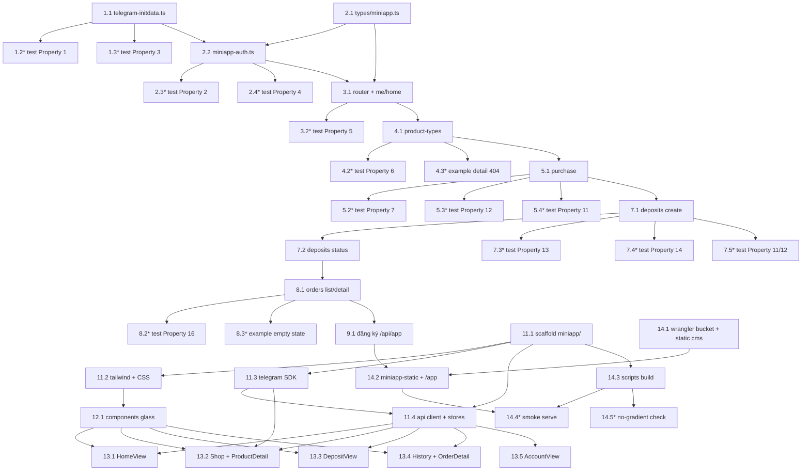

# Implementation Plan — Telegram Mini App

## Overview

Kế hoạch triển khai Mini App theo nguyên tắc **tái sử dụng tối đa** service/util hiện có và **không viết lại logic atomic** (đã được phủ test ở spec gốc `telegram-shop-bot`). Thứ tự thực thi tăng dần: backend (xác thực initData → middleware → endpoints `/api/app/*` → đăng ký route) rồi frontend (`miniapp/` scaffold → SDK/client/design-system → components → views) và cuối cùng build & serve trong cùng Worker.

Mỗi task tham chiếu Requirements và/hoặc Correctness Property tương ứng trong `design.md`. Ngôn ngữ triển khai: **TypeScript** (backend Hono + Web Crypto, frontend Vue 3 + Vite + Tailwind).

## Tasks

- [x] 1. Xác thực initData (backend util)
  - [x] 1.1 Viết `src/utils/telegram-initdata.ts`
    - Hàm `verifyInitData(rawInitData, botToken)`: parse `URLSearchParams`, dựng `data_check_string` (bỏ `hash`, sort key, nối bằng `\n`), HMAC-SHA256 2 bước (`secret_key = HMAC("WebAppData", botToken)` → `computed = HMAC(secret_key, dataCheckString)`) bằng Web Crypto, so sánh hằng-thời-gian với `hash`; trích `telegram_id`, `username`, `first_name`, `auth_date`; trả `InitDataParsed` hoặc `null`
    - Hàm `isInitDataFresh(authDate, ttlSeconds, nowSeconds)`: kiểm `0 <= now - authDate <= ttl`
    - Export interface `InitDataParsed`
    - _Requirements: 1.2, 1.4, 1.5, 2.1, 2.4, 16.1_

  - [x] 1.2 Viết property test cho verifyInitData (round-trip)
    - **Property 1: Xác thực initData round-trip**
    - **Validates: Requirements 1.2, 1.4**
    - Ký initData hợp lệ → `verifyInitData` trả kết quả; đột biến `hash` hoặc bất kỳ cặp `key=value` → trả `null`
    - Tag: `Feature: telegram-mini-app, Property 1`

  - [x] 1.3 Viết property test cho TTL/chống replay
    - **Property 3: TTL chống replay**
    - **Validates: Requirements 2.2, 2.4**
    - `isInitDataFresh` chấp nhận khi và chỉ khi `now - auth_date ∈ [0, TTL]`
    - Tag: `Feature: telegram-mini-app, Property 3`

- [x] 2. DTO types + middleware xác thực
  - [x] 2.1 Viết `src/types/miniapp.ts`
    - Định nghĩa DTO tầng Mini App (không phải bảng DB): `MeDto`, `ProductTypeListItemDto`, `ProductTypeDetailDto`, `PurchaseResultDto`, `DepositCreatedDto`, `DepositStatusDto`, `OrderListItemDto`, `OrderDetailDto` và re-export `InitDataParsed`
    - _Requirements: 1.5_

  - [x] 2.2 Viết `src/middleware/miniapp-auth.ts`
    - Middleware `miniAppAuth` (Hono factory): đọc header `X-Telegram-Init-Data` → thiếu = 401; gọi `verifyInitData` → sai = 401; `isInitDataFresh` (TTL 3600s) → hết hạn = 401; gọi `getOrCreateUser` và `c.set('telegramId')`, `c.set('user')`
    - Hàm `getOrCreateUser(db, parsed)`: `INSERT ... ON CONFLICT(telegram_id) DO UPDATE` (balance=0 khi tạo mới, idempotent), trả `DbUser`; định danh JOIN/lọc qua `telegram_id`, KHÔNG dùng làm `users.id`; KHÔNG phát hành JWT/session
    - Export type `MiniAppVariables`
    - _Requirements: 1.3, 1.4, 1.6, 1.7, 2.2, 3.1, 3.2, 3.3, 15.2_

  - [x] 2.3 Viết property test cho từ chối initData không hợp lệ
    - **Property 2: initData không hợp lệ luôn bị từ chối 401**
    - **Validates: Requirements 1.3, 1.4, 2.3, 15.2**
    - Thiếu header / `hash` sai / thiếu `auth_date` → 401 và không chạm logic nghiệp vụ
    - Tag: `Feature: telegram-mini-app, Property 2`

  - [x] 2.4 Viết property test cho tự tạo user idempotent
    - **Property 4: Tự tạo user idempotent với balance khởi tạo 0**
    - **Validates: Requirements 3.1, 3.2, 3.3**
    - Sau 1..n request đã xác thực cho cùng `telegram_id` → đúng 1 bản ghi `users`; bản ghi mới có `balance = 0` (chạy trên D1 thật của `@cloudflare/vitest-pool-workers`)
    - Tag: `Feature: telegram-mini-app, Property 4`

- [x] 3. Router `/api/app` + endpoint me + home
  - [x] 3.1 Tạo `src/routes/miniapp-api.ts` và endpoint me/home
    - Khởi tạo Hono app, áp `miniAppApi.use('/*', miniAppAuth)` cho toàn prefix
    - `GET /me`: trả `MeDto` từ `c.get('user')`, `balance_display = formatCurrency(balance)`; KHÔNG trả field admin
    - `GET /home`: trả `balance`, `balance_display`, `shortcuts`
    - Reuse `formatCurrency` từ `src/utils/format.ts`; dùng `ApiResponse<T>` (`src/types/api.ts`)
    - _Requirements: 4.1, 4.2, 4.3, 4.4, 12.1, 12.2, 12.3_

  - [x] 3.2 Viết property test cho me/home phản ánh DB + định dạng
    - **Property 5: Dữ liệu người mua phản ánh đúng DB và đúng định dạng**
    - **Validates: Requirements 4.1, 4.2, 12.1, 12.2**
    - `telegram_id/username/first_name/balance` khớp bản ghi `users`; `balance_display === formatCurrency(balance)`
    - Tag: `Feature: telegram-mini-app, Property 5`

- [x] 4. Danh mục & chi tiết sản phẩm
  - [x] 4.1 Thêm endpoint product-types vào `src/routes/miniapp-api.ts`
    - `GET /product-types`: query `is_visible = 1`, `LEFT JOIN products` đếm `stock = COUNT(status='available')`, `ORDER BY sort_order ASC, name ASC`, **bao gồm cả loại hết hàng**; map `price_display`, `in_stock = stock > 0`
    - `GET /product-types/:id`: trả chi tiết (mô tả, giá, stock, `max_quantity`); 404 nếu không tồn tại hoặc `is_visible = 0`; KHÔNG trả `success_template`
    - _Requirements: 5.1, 5.2, 5.3, 5.4_

  - [x] 4.2 Viết property test cho danh mục
    - **Property 6: Danh mục lọc theo hiển thị, sắp xếp và đếm tồn kho đúng**
    - **Validates: Requirements 5.1, 5.2, 5.4**
    - Chỉ gồm `is_visible = 1`, sắp `sort_order` tăng dần, `stock` = số `products` `available`, `in_stock = (stock > 0)`
    - Tag: `Feature: telegram-mini-app, Property 6`

  - [x] 4.3 Viết example test cho chi tiết sản phẩm
    - 404 khi `id` không tồn tại hoặc `is_visible = 0`; response không chứa `success_template`
    - _Requirements: 5.3, 5.4_

- [x] 5. Mua hàng (reuse executePurchase + đồng bộ bot)
  - [x] 5.1 Thêm endpoint `POST /purchase` vào `src/routes/miniapp-api.ts`
    - Validate input `quantity` (integer, `1..50`) → 400 `validation_error`
    - Rate-limit double-tap: reuse `consumeToken` + `PURCHASE_RULE` (`src/bot/rate-limit.ts`) → 429 `rate_limited`
    - Lấy `product_types` theo `id AND is_visible = 1` → 404; tính `totalAmount = price × quantity` **server-side** (không tin client)
    - Reuse `transactionService.executePurchase(db, user.id, typeId, qty, price)`; map lỗi service → HTTP (`insufficient_balance`/`insufficient_stock` → 409, `db_error` → 500)
    - Sau commit: dựng HTML qua `renderSuccessMessage` (`src/utils/telegram-template.ts`) và gửi `sendMessage` (`src/bot/telegram-api.ts`) qua `c.executionCtx.waitUntil(promise.catch(log))` — lỗi gửi tin KHÔNG rollback
    - Trả `PurchaseResultDto` (order_id, quantity, total_amount, new_balance + display, contents)
    - _Requirements: 6.1, 6.2, 6.3, 6.4, 6.5, 6.6, 6.7, 7.1, 7.2, 7.3, 7.5, 15.3, 16.2, 16.3_

  - [x] 5.2 Viết property test cho tổng tiền
    - **Property 7: Tổng tiền bằng giá nhân số lượng**
    - **Validates: Requirements 6.1**
    - Với mọi `price`, `quantity` hợp lệ: tổng tiền Worker tính = `price × quantity`
    - Tag: `Feature: telegram-mini-app, Property 7`

  - [x] 5.3 Viết test cho lỗi gửi tin không rollback (mua hàng)
    - **Property 12: Lỗi gửi tin nhắn bot không rollback giao dịch đã commit**
    - **Validates: Requirements 7.5**
    - Mock `sendMessage` ném lỗi → response 200 và trạng thái DB (balance, orders, products) giống hệt khi gửi tin thành công
    - Tag: `Feature: telegram-mini-app, Property 12`

  - [x] 5.4 Viết example test escape HTML tin nhắn mua hàng
    - **Property 11: Escape HTML cho giá trị động trong tin nhắn**
    - **Validates: Requirements 7.4, 15.1**
    - Content/name chứa `& < >` → HTML do `renderSuccessMessage` dựng không chứa ký tự thô chưa escape
    - Tag: `Feature: telegram-mini-app, Property 11`

- [x] 6. Checkpoint
  - Ensure all tests pass, ask the user if questions arise.

- [x] 7. Nạp tiền (reuse transfer-code + vietqr + sendPhoto)
  - [x] 7.1 Thêm endpoint `POST /deposits` vào `src/routes/miniapp-api.ts`
    - Helper `readDepositLimits(db)` đọc `min_deposit`/`max_deposit` từ `system_config`; helper `buildDepositCaption(...)` escape HTML giá trị động (`bank_owner`, `transfer_code`)
    - Validate `amount ∈ [min, max]` → 400 với message nêu rõ giới hạn (không tạo `deposits`)
    - Rate-limit: reuse `DEPOSIT_RULE`; huỷ pending cũ (`UPDATE deposits SET status='cancelled' WHERE user_id=? AND status='pending'`)
    - Tạo `deposits` pending với `transfer_code = generateTransferCode(...)` (`src/utils/transfer-code.ts`); dựng `qr_url = generateVietQRUrl(...)` (`src/utils/vietqr.ts`)
    - Sau commit: `sendPhoto` ảnh VietQR + caption qua `waitUntil(promise.catch(log))` — lỗi gửi tin KHÔNG rollback
    - Trả `DepositCreatedDto`
    - _Requirements: 8.1, 8.2, 8.3, 8.4, 8.5, 10.1, 10.3, 10.4_

  - [x] 7.2 Thêm endpoint `GET /deposits/:id` vào `src/routes/miniapp-api.ts`
    - Trả trạng thái deposit (`pending|completed|expired|cancelled`) cho frontend poll; guard chỉ trả deposit thuộc `user.id`, ngược lại 404; chỉ đọc (việc cộng tiền do `/webhook/sepay` đảm nhận)
    - _Requirements: 8.5, 9.1_

  - [x] 7.3 Viết property test cho validate khoảng số tiền nạp
    - **Property 13: Validate khoảng số tiền nạp**
    - **Validates: Requirements 8.2, 8.3**
    - Tạo deposit khi và chỉ khi `min ≤ amount ≤ max`; ngoài khoảng → 400 + message giới hạn, không tạo bản ghi `deposits`
    - Tag: `Feature: telegram-mini-app, Property 13`

  - [x] 7.4 Viết property test cho transfer_code + tham số VietQR
    - **Property 14: Transfer code hợp lệ và phân biệt; VietQR mang đúng tham số**
    - **Validates: Requirements 8.3, 8.4**
    - Mỗi `transfer_code` khớp `NAP[A-Z0-9]{4,17}` và đôi một phân biệt; `qr_url` chứa đúng `amount` và `addInfo = transfer_code`
    - Tag: `Feature: telegram-mini-app, Property 14`

  - [x] 7.5 Viết test escape caption + lỗi gửi tin không rollback (nạp tiền)
    - **Property 11: Escape HTML** (caption nạp tiền) — **Validates: Requirements 10.3, 15.1**
    - **Property 12: Lỗi gửi tin nhắn bot không rollback** (mock `sendPhoto` ném lỗi → deposit vẫn `pending`, response 200) — **Validates: Requirements 10.4**
    - Tag: `Feature: telegram-mini-app, Property 11, Property 12`

- [x] 8. Lịch sử đơn hàng (cô lập dữ liệu)
  - [x] 8.1 Thêm endpoint orders vào `src/routes/miniapp-api.ts`
    - `GET /orders`: query `WHERE o.user_id = ?` (lấy từ `telegram_id`), `JOIN product_types`, `ORDER BY created_at DESC`, phân trang `LIMIT/OFFSET` + `meta`; trả `[]` khi chưa có đơn
    - `GET /orders/:id`: guard `WHERE o.id = ? AND o.user_id = ?`; rỗng → **404** (không phân biệt để tránh dò ID); chỉ khi thuộc người mua mới trả `contents` (`products.content`)
    - _Requirements: 11.1, 11.2, 11.3, 11.4, 15.3_

  - [x] 8.2 Viết property test cho cô lập dữ liệu người mua
    - **Property 16: Cô lập dữ liệu theo người mua**
    - **Validates: Requirements 11.1, 11.2, 11.3, 15.3**
    - `/orders` chỉ trả đơn của người mua hiện tại (sắp `created_at` giảm dần); `/orders/:id` của người khác → 404 và không lộ `products.content`
    - Tag: `Feature: telegram-mini-app, Property 16`

  - [x] 8.3 Viết example test cho trạng thái trống lịch sử
    - Người mua chưa có đơn → `/orders` trả mảng rỗng `[]`
    - _Requirements: 11.4_

- [x] 9. Đăng ký route API vào Worker
  - [x] 9.1 Đăng ký `miniAppApi` trong `src/index.ts`
    - Thêm `app.route('/api/app', miniAppApi)` **trước** 404 fallback; giữ nguyên `/cms`, `/api/admin`, `/webhook/*`
    - _Requirements: 14.4_

- [x] 10. Checkpoint
  - Ensure all tests pass, ask the user if questions arise.

- [x] 11. Scaffold frontend `miniapp/`
  - [x] 11.1 Khởi tạo dự án `miniapp/`
    - `package.json` (vue, vue-router, vite, tailwind, postcss, autoprefixer), `vite.config.ts` (`base: '/app/'`, `build.outDir = ../dist/miniapp`, `emptyOutDir`, dev proxy `/api`), `postcss.config.js`
    - `index.html` nhúng `https://telegram.org/js/telegram-web-app.js`; `src/main.ts` (khởi tạo Vue + router + init Telegram SDK); `src/App.vue` (layout safe-area + `<RouterView>`); `src/router/index.ts` (`createWebHistory('/app/')` với route Home/Shop/ProductDetail/Deposit/History/OrderDetail/Account)
    - _Requirements: 14.1_

  - [x] 11.2 Cấu hình Tailwind + design-system CSS (no-gradient)
    - `tailwind.config.js`: `darkMode: 'class'`, map màu sang CSS variables (màu phẳng), `borderRadius/backdropBlur/transitionTimingFunction/boxShadow` kiểu iOS; KHÔNG khai báo gradient util
    - CSS gốc: định nghĩa CSS variables theme (light/dark), class `.glass` (fill phẳng + `backdrop-filter: blur` + viền 1px + shadow), easing `--ease-ios`, biến safe-area; tôn trọng `prefers-reduced-motion`
    - _Requirements: 13.1, 13.2, 13.3, 13.4_

  - [x] 11.3 Viết Telegram SDK wrapper `src/telegram/sdk.ts` + `src/telegram/theme.ts`
    - `initTelegram()`: `ready()`, `expand()`, `applyTheme(themeParams, colorScheme)` (map → CSS variables, light/dark), `applySafeArea(...)`; lắng nghe `themeChanged`/`viewportChanged`
    - Export `initData` (chuỗi thô), `haptic(kind)`, `showMainButton(text, onClick)`, `showBackButton(onClick)`
    - _Requirements: 13.5, 13.6, 13.7_

  - [x] 11.4 Viết API client `src/api/client.ts` + stores
    - `request<T>()` fetch wrapper gắn header `X-Telegram-Init-Data` (mọi request), parse `ApiResponse`, ném `ApiError`, xử lý 401 (màn "Mở lại từ Telegram"); KHÔNG lưu token/localStorage (stateless)
    - `stores/user.ts` (me/balance reactive), `stores/ui.ts` (loading, toast, haptic helper)
    - _Requirements: 1.1, 1.7_

- [x] 12. Components liquid glass
  - [x] 12.1 Viết components dùng chung
    - `GlassCard.vue`, `GlassButton.vue`, `BalanceBadge.vue`, `ProductCard.vue`, `QtyStepper.vue`, `QrPanel.vue`, `EmptyState.vue` — dùng class `.glass`/token phẳng, target chạm ≥ 44px, KHÔNG gradient
    - _Requirements: 13.1, 13.2, 13.3_

- [x] 13. Views
  - [x] 13.1 `HomeView.vue`
    - Hiển thị số dư (định dạng thống nhất) + lối tắt nhanh (shop/deposit/history/account) điều hướng router
    - _Requirements: 4.1, 4.2, 4.3, 4.4_

  - [x] 13.2 `ShopView.vue` + `ProductDetailView.vue`
    - Shop: list `product-types` (tên, emoji, giá, stock), loại hết hàng hiển thị trạng thái + disable mua
    - Detail: mô tả/giá/stock, `QtyStepper`, tổng tiền = giá × qty, MainButton "Xác nhận mua" gọi `POST /purchase` + `haptic('success')` khi thành công, hiển thị contents + số dư mới; BackButton
    - _Requirements: 5.1, 5.2, 5.3, 5.4, 6.1, 6.6, 6.7, 13.5_

  - [x] 13.3 `DepositView.vue`
    - Chọn mệnh giá định sẵn hoặc nhập số tiền; MainButton "Tạo mã nạp" gọi `POST /deposits` + `haptic`; hiển thị `QrPanel` (VietQR + bank info + transfer_code); poll `GET /deposits/:id` (backoff) tới `completed`, cập nhật số dư store
    - _Requirements: 8.1, 8.4, 8.5, 13.5_

  - [x] 13.4 `HistoryView.vue` + `OrderDetailView.vue`
    - History: list đơn (tên loại, số lượng, tổng tiền, trạng thái, thời gian) giảm dần; `EmptyState` khi trống
    - OrderDetail: gọi `GET /orders/:id`, hiển thị contents; BackButton
    - _Requirements: 11.1, 11.2, 11.3, 11.4_

  - [x] 13.5 `AccountView.vue`
    - Hiển thị số dư + `telegram_id`, `username`, `first_name` từ `GET /me`; KHÔNG có chức năng quản trị
    - _Requirements: 12.1, 12.2, 12.3_

- [x] 14. Build & serve trong cùng Worker
  - [x] 14.1 Cập nhật bucket Wrangler + static CMS theo prefix
    - `wrangler.toml`: đổi `[site].bucket` từ `./dist/cms` sang `./dist`
    - `src/routes/static.ts`: cập nhật key prefix sang `cms/...` (map `/cms/*` → `cms/...` trong KV `__STATIC_CONTENT`), giữ SPA fallback `cms/index.html`
    - _Requirements: 14.3, 14.4_

  - [x] 14.2 Tạo static handler Mini App + đăng ký route `/app`
    - `src/routes/miniapp-static.ts`: clone pattern `static.ts`, map `/app/*` → key `miniapp/...`, SPA fallback `miniapp/index.html` (history mode), set `Content-Type` + `Cache-Control`
    - `src/index.ts`: thêm `app.route('/app', miniAppStatic)` **trước** 404, sau `/api/app`
    - _Requirements: 14.3_

  - [x] 14.3 Thêm scripts build vào root `package.json`
    - `build:miniapp` (→ `dist/miniapp`), `build:all` (`build:cms` + `build:miniapp`), `predeploy` (`build:all`)
    - _Requirements: 14.2, 14.5_

  - [x] 14.4 Viết smoke/integration test serve
    - `GET /app` trả `index.html`; `/cms` và `/webhook/*` vẫn hoạt động; `build:miniapp` tạo `dist/miniapp/index.html`; mock `sendPhoto`/`sendMessage` được gọi đúng tham số
    - _Requirements: 14.2, 14.3, 14.4, 10.1, 10.2_

  - [x] 14.5 Viết kiểm tĩnh no-gradient
    - Quét `dist/miniapp` (CSS/JS/HTML) đảm bảo không có `gradient` (`bg-gradient-*`, `linear-gradient`, `radial-gradient`, `conic-gradient`)
    - _Requirements: 13.3_

- [x] 15. Final checkpoint
  - Ensure all tests pass, ask the user if questions arise.

## Notes

- Task có hậu tố `*` là **tùy chọn** (test) — có thể bỏ qua khi cần MVP nhanh; các task lõi không bao giờ tùy chọn.
- **Tái sử dụng, không viết lại**: `transactionService.executePurchase`/`executeDeposit`, `renderSuccessMessage`, `sendMessage`/`sendPhoto`, `generateTransferCode`, `generateVietQRUrl`, `formatCurrency`, `consumeToken`/`PURCHASE_RULE`/`DEPOSIT_RULE`.
- **Không lặp test logic atomic đã phủ ở spec gốc**: Property 8 (mua bảo toàn sổ cái), Property 9 (mua thất bại không đổi trạng thái), Property 10 (số dư không âm), Property 15 (cộng tiền nạp đúng + idempotent SePay) thuộc `executePurchase`/`executeDeposit`/`/webhook/sepay` — đã được phủ ở spec `telegram-shop-bot`, KHÔNG tạo task test trùng. Test Mini App tập trung lớp mới: middleware initData, controller `/api/app/*`, đồng bộ tin nhắn (không rollback), build/serve.
- Property tests chạy bằng fast-check (≥100 iterations) trên môi trường `@cloudflare/vitest-pool-workers` với D1 thật, theo file `test/**/*.{test,spec}.ts`.
- Kiểm tĩnh no-gradient (14.5) và smoke serve (14.4) là kiểm tra hạ tầng/cấu hình — KHÔNG dùng PBT (theo Testing Strategy của design).
- Endpoint `/api/app/*` đều qua `miniAppApi.use('/*', miniAppAuth)` nên mặc định yêu cầu initData hợp lệ; `telegram_id` chỉ lấy từ initData đã verify, không nhận từ body (chống IDOR/giả mạo).

## Task Dependency Graph

Sơ đồ phụ thuộc (mermaid) — node là task lá; cạnh thể hiện "phải hoàn thành trước". Các task ghi cùng một file (`src/routes/miniapp-api.ts`: 3.1→4.1→5.1→7.1→7.2→8.1; `src/index.ts`: 9.1→14.2) được xếp tuần tự để tránh xung đột ghi.



```json
{
  "waves": [
    { "id": 0, "tasks": ["1.1", "2.1", "11.1", "14.1", "14.3"] },
    { "id": 1, "tasks": ["1.2", "1.3", "2.2", "11.2", "11.3"] },
    { "id": 2, "tasks": ["2.3", "2.4", "3.1", "11.4", "12.1"] },
    { "id": 3, "tasks": ["3.2", "4.1", "13.1"] },
    { "id": 4, "tasks": ["4.2", "4.3", "5.1", "13.2"] },
    { "id": 5, "tasks": ["5.2", "5.3", "5.4", "7.1", "13.3"] },
    { "id": 6, "tasks": ["7.2", "13.4", "13.5"] },
    { "id": 7, "tasks": ["7.3", "7.4", "7.5", "8.1"] },
    { "id": 8, "tasks": ["8.2", "8.3", "9.1"] },
    { "id": 9, "tasks": ["14.2"] },
    { "id": 10, "tasks": ["14.4", "14.5"] }
  ]
}
```
