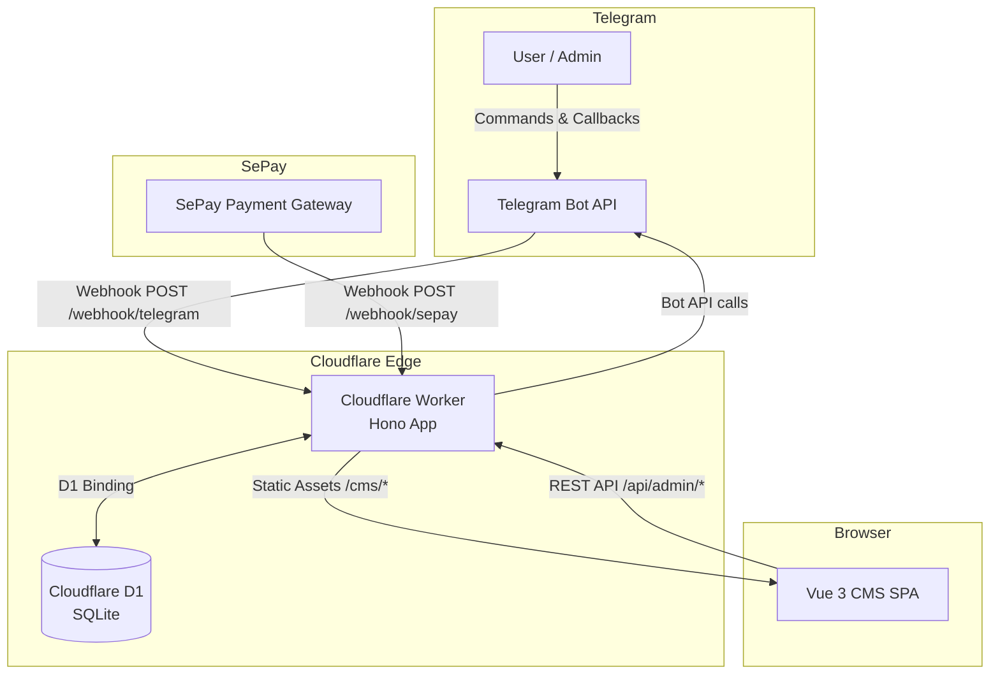
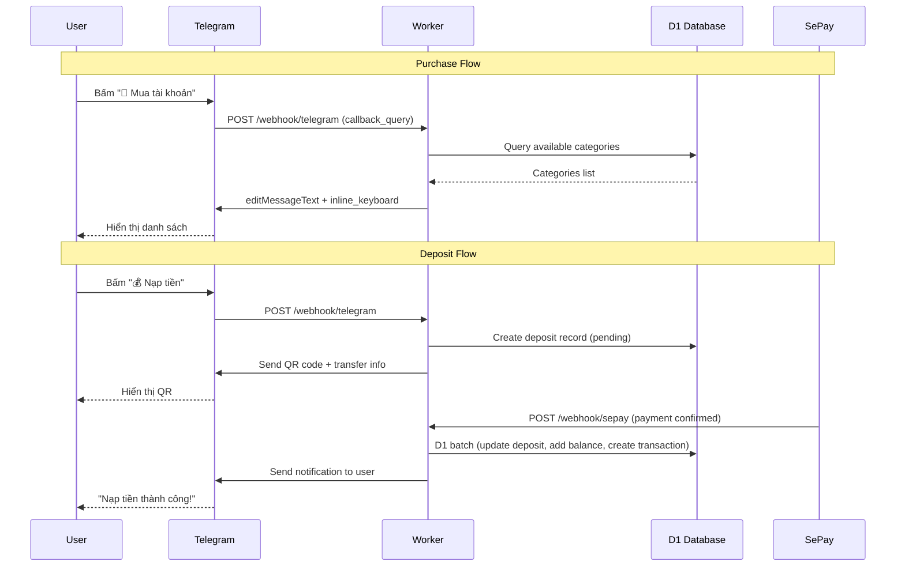
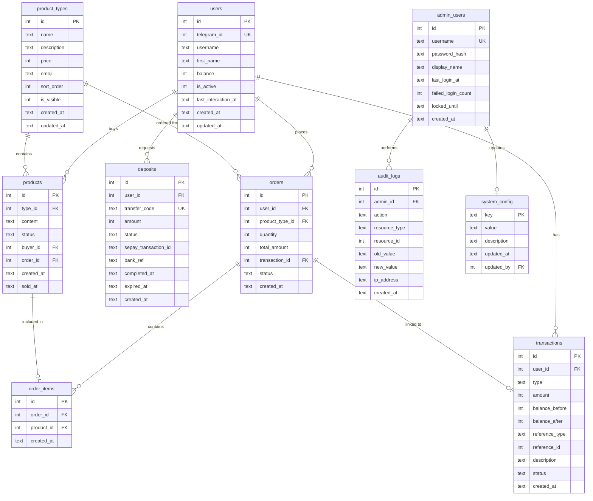
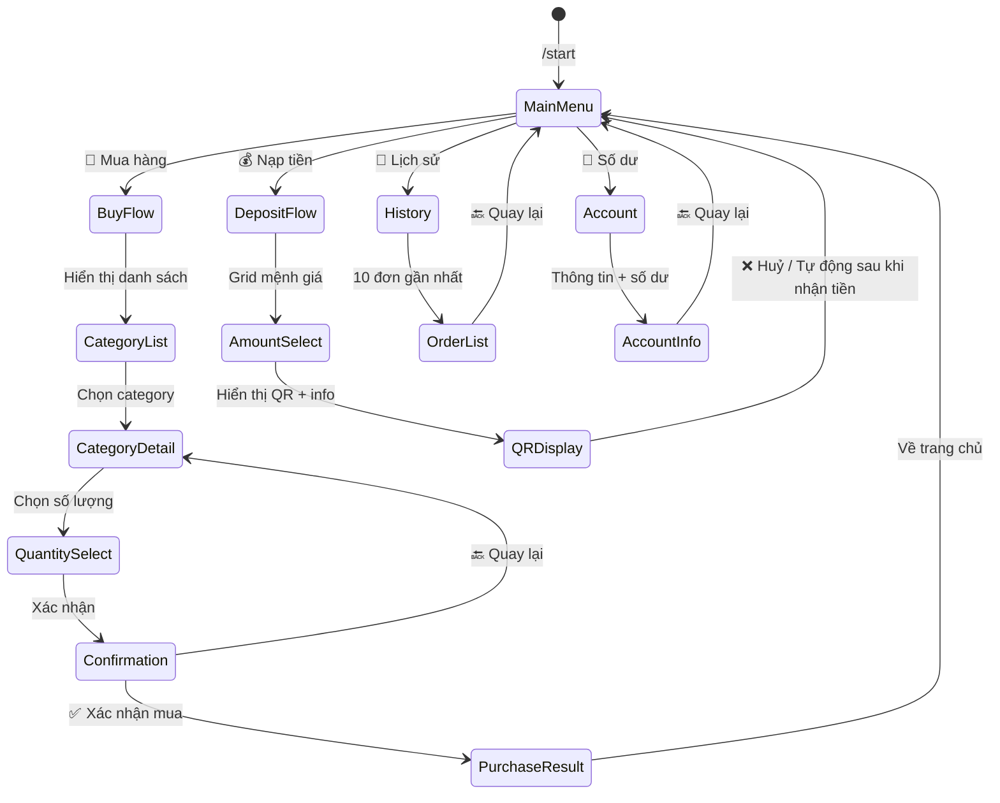
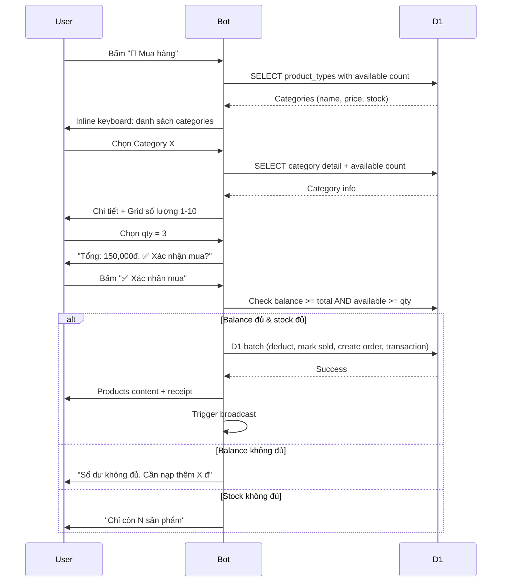
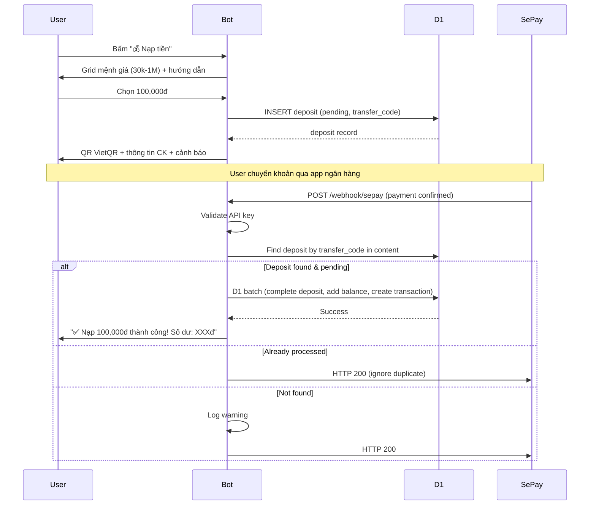
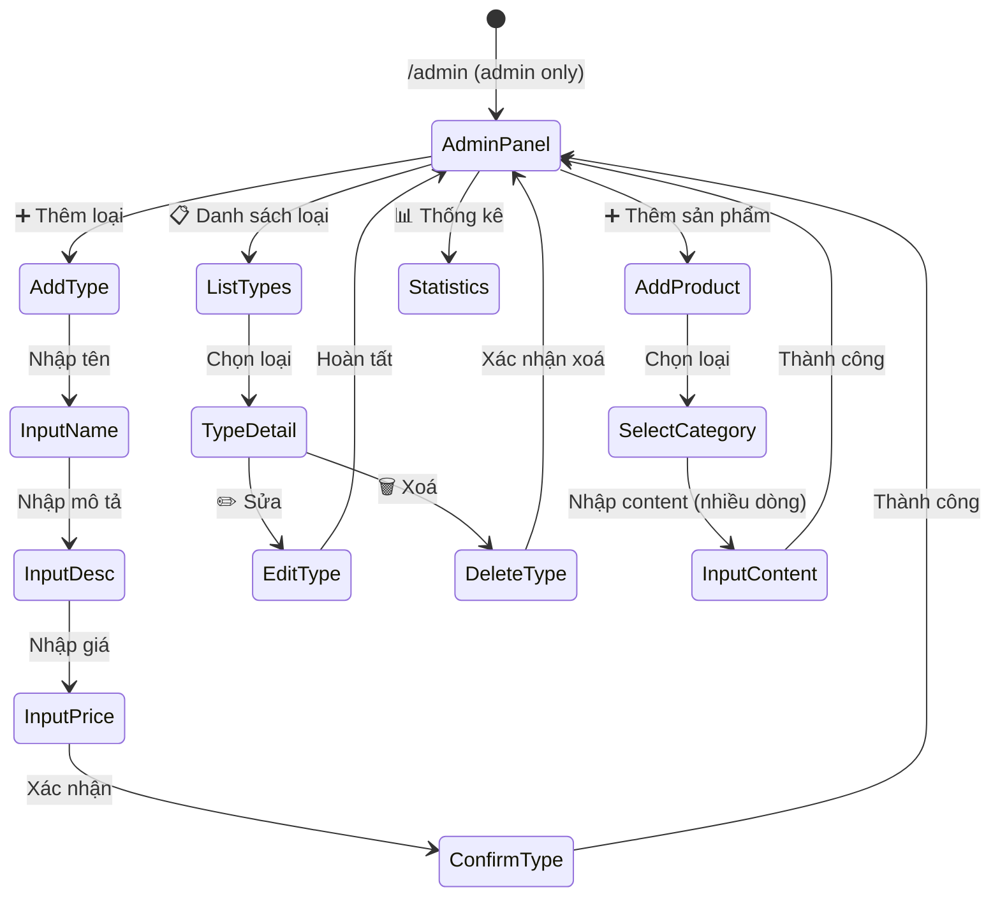

# Design Document: Telegram Shop Bot

## Overview

Hệ thống bot bán tài khoản số qua Telegram, tích hợp thanh toán SePay và quản trị qua CMS Vue 3. Toàn bộ backend chạy trên một Cloudflare Worker duy nhất (Hono framework), phục vụ đồng thời:

1. **Telegram Bot Webhook** — nhận và xử lý lệnh/callback từ Telegram
2. **SePay Webhook** — nhận thông báo thanh toán thành công
3. **CMS REST API** — API backend cho giao diện quản trị
4. **Static Assets** — serve Vue 3 SPA build artifacts

### Quyết định kiến trúc chính

| Quyết định | Lý do |
|---|---|
| Single Worker phục vụ tất cả | Đơn giản deployment, share D1 binding, giảm cold start |
| Hono framework | Lightweight, type-safe, native Cloudflare Workers support, middleware ecosystem |
| D1 batch() cho atomic writes | Đảm bảo consistency cho multi-table operations (mua hàng, nạp tiền) |
| JWT (jose) cho CMS auth | Stateless, không cần session store, tương thích Workers runtime |
| INTEGER cho tiền tệ | Tránh floating-point errors với VNĐ (không có phần thập phân) |
| ISO 8601 UTC TEXT timestamps | Cross-timezone, human-readable, SQLite TEXT comparison vẫn đúng thứ tự |
| Soft-delete pattern | Bảo toàn audit trail, cho phép phục hồi dữ liệu |
| VietQR image URL | Không cần generate QR server-side, dùng API chuẩn img.vietqr.io |

## Architecture

### High-Level Architecture Diagram



### Request Flow



### Worker Router Structure

```typescript
// src/index.ts
import { Hono } from 'hono'
import { telegramWebhook } from './routes/telegram'
import { sepayWebhook } from './routes/sepay'
import { adminApi } from './routes/admin'
import { staticAssets } from './routes/static'

type Bindings = {
  DB: D1Database
  BOT_TOKEN: string
  TELEGRAM_SECRET_TOKEN: string
  SEPAY_API_KEY: string
  ADMIN_IDS: string
  JWT_SECRET: string
  BROADCAST_ENABLED: string
  BANK_NAME: string
  BANK_ACCOUNT: string
  BANK_OWNER: string
}

const app = new Hono<{ Bindings: Bindings }>()

// Webhook routes
app.route('/webhook', telegramWebhook)
app.route('/webhook', sepayWebhook)

// CMS API (JWT protected)
app.route('/api/admin', adminApi)

// Static assets for CMS
app.route('/cms', staticAssets)

// 404 fallback
app.all('*', (c) => c.json({ error: 'Not Found' }, 404))

export default app
```

## Components and Interfaces

### 1. Telegram Bot Handler

**Trách nhiệm**: Xử lý commands, callback queries, text messages từ Telegram.

```typescript
// src/bot/handler.ts
interface TelegramUpdate {
  update_id: number
  message?: Message
  callback_query?: CallbackQuery
}

interface BotContext {
  db: D1Database
  botToken: string
  adminIds: number[]
  update: TelegramUpdate
  user: DbUser | null
}

// Command handlers
type CommandHandler = (ctx: BotContext) => Promise<void>

// Callback handlers (router pattern: "action:param1:param2")
type CallbackHandler = (ctx: BotContext, params: string[]) => Promise<void>
```

**Callback Data Format**: `action:param1:param2:...` (max 64 bytes Telegram limit)

| Prefix | Ví dụ | Mô tả |
|--------|--------|--------|
| `menu` | `menu:main` | Điều hướng menu |
| `cat` | `cat:5` | Xem category id=5 |
| `qty` | `qty:5:3` | Chọn qty=3 cho category_id=5 |
| `buy` | `buy:5:3` | Xác nhận mua category=5, qty=3 |
| `dep` | `dep:50000` | Chọn mệnh giá 50000 |
| `page` | `page:cat:2` | Trang 2 danh sách category |
| `adm` | `adm:addtype` | Admin action |

### 2. SePay Webhook Handler

**Trách nhiệm**: Xác thực và xử lý webhook thanh toán từ SePay.

**SePay Webhook Payload** (HTTP POST, JSON body):

```typescript
// src/webhook/sepay.ts
// Payload chính xác từ docs.sepay.vn
interface SepayWebhookPayload {
  id: number                  // ID giao dịch trên SePay (dùng để chống trùng lặp - UNIQUE)
  gateway: string             // Tên ngân hàng (vd: "Vietcombank")
  transactionDate: string     // Ngày giao dịch "2024-07-02 11:08:33"
  accountNumber: string       // Số tài khoản nhận (vd: "1017588888")
  subAccount: string | null   // Tài khoản phụ (VA) nếu có
  code: string | null         // Mã giao dịch SePay tự nhận diện (vd: "SEVN63DC8E5C")
  content: string             // Nội dung chuyển khoản (chứa transfer_code)
  transferType: 'in' | 'out'  // "in" = tiền vào, "out" = tiền ra
  description: string         // Mô tả giao dịch từ ngân hàng
  transferAmount: number      // Số tiền chuyển khoản (VNĐ)
  accumulated: number         // Số dư tích lũy sau giao dịch
  referenceCode: string       // Mã tham chiếu ngân hàng (vd: "FT24012345678")
}

// Xác thực: SePay gửi header "Authorization: Apikey API_KEY_CUA_BAN"
// Phản hồi hợp lệ: HTTP 200/201 + body {"success": true} (trong 30 giây)
// Nếu không → SePay retry tối đa 7 lần (Fibonacci interval, max 5 giờ)

// Chống trùng lặp: Dùng field `id` làm UNIQUE trong DB
// Cùng giao dịch có thể nhận webhook nhiều lần (retry, gửi lại thủ công, multi webhook)

interface SepayHandler {
  // Validate Authorization header: "Apikey {SEPAY_API_KEY}"
  validateAuth(request: Request, apiKey: string): boolean
  
  // Parse transfer_code từ content field
  extractTransferCode(content: string): string | null
  
  // Process: find deposit by transfer_code → atomic update balance
  processDeposit(db: D1Database, payload: SepayWebhookPayload): Promise<ProcessResult>
  
  // Idempotency check: dùng payload.id (sepay_transaction_id)
  isDuplicate(db: D1Database, sepayId: number): Promise<boolean>
}
```

**SePay Integration Flow:**
1. Tạo webhook trên my.sepay.vn → URL: `https://{worker-domain}/webhook/sepay`
2. Sự kiện: "Có tiền vào"
3. Xác thực: API Key → SePay gửi `Authorization: Apikey {key}`
4. Worker nhận webhook → validate auth → parse content tìm transfer_code → match deposit pending → atomic cộng tiền

**SePay IP Whitelist** (optional, thêm layer bảo mật):
- IPv4: `172.236.138.20`, `172.233.83.68`, `171.244.35.2`, `151.158.108.68`, `151.158.109.79`, `103.255.238.139`
- IPv6: `2400:8905::2000:8cff:fe98:45cd`, `2600:3c15::2000:8aff:fedd:874b`

> **Lưu ý**: Cloudflare Workers không kiểm tra IP nguồn trực tiếp (request qua Cloudflare proxy). API Key auth là đủ bảo mật.

**SePay Webhook Processing Logic (chi tiết):**

```typescript
// src/routes/sepay.ts
async function handleSepayWebhook(c: Context): Promise<Response> {
  // 1. Validate auth header
  const authHeader = c.req.header('Authorization')
  if (authHeader !== `Apikey ${c.env.SEPAY_API_KEY}`) {
    return c.json({ success: false }, 401)
  }

  const payload: SepayWebhookPayload = await c.req.json()

  // 2. Chỉ xử lý tiền VÀO
  if (payload.transferType !== 'in') {
    return c.json({ success: true }) // Ignore outgoing
  }

  // 3. Idempotency: check sepay id đã xử lý chưa
  const duplicate = await c.env.DB.prepare(
    'SELECT id FROM deposits WHERE sepay_transaction_id = ?'
  ).bind(String(payload.id)).first()
  if (duplicate) {
    return c.json({ success: true }) // Already processed
  }

  // 4. Extract transfer code từ content
  // Content format từ ngân hàng: "NAP0042A3B7CF chuyen tien"
  // Tìm pattern NAP + alphanumeric (6-20 chars)
  const match = payload.content.match(/NAP[A-Z0-9]{4,17}/i)
  const transferCode = match ? match[0].toUpperCase() : null

  if (!transferCode) {
    console.warn('[SePay] No transfer code in content:', payload.content)
    return c.json({ success: true }) // Không match, bỏ qua
  }

  // 5. Tìm deposit pending
  const deposit = await c.env.DB.prepare(
    'SELECT * FROM deposits WHERE transfer_code = ? AND status = ?'
  ).bind(transferCode, 'pending').first()

  if (!deposit) {
    console.warn('[SePay] No pending deposit for code:', transferCode)
    return c.json({ success: true })
  }

  // 6. Validate amount range
  const amount = payload.transferAmount
  if (amount < 20000 || amount > 100000000) {
    console.warn('[SePay] Amount out of range:', amount)
    return c.json({ success: true })
  }

  // 7. Atomic: cộng balance + complete deposit + create transaction
  const user = await c.env.DB.prepare('SELECT * FROM users WHERE id = ?').bind(deposit.user_id).first()
  const now = new Date().toISOString()
  const balanceBefore = user.balance
  const balanceAfter = balanceBefore + amount

  const results = await c.env.DB.batch([
    c.env.DB.prepare('UPDATE users SET balance = ?, updated_at = ? WHERE id = ?')
      .bind(balanceAfter, now, user.id),
    c.env.DB.prepare('UPDATE deposits SET status = ?, sepay_transaction_id = ?, completed_at = ? WHERE id = ?')
      .bind('completed', String(payload.id), now, deposit.id),
    c.env.DB.prepare(
      'INSERT INTO transactions (user_id, type, amount, balance_before, balance_after, reference_type, reference_id, description, status, created_at) VALUES (?, ?, ?, ?, ?, ?, ?, ?, ?, ?)'
    ).bind(user.id, 'deposit', amount, balanceBefore, balanceAfter, 'deposit', deposit.id, `Nạp ${amount.toLocaleString()}đ`, 'success', now)
  ])

  // 8. Gửi notification cho user (async, không block response)
  c.executionCtx.waitUntil(
    sendTelegramMessage(c.env.BOT_TOKEN, user.telegram_id,
      `✅ Nạp tiền thành công!\n💰 Số tiền: ${amount.toLocaleString()}đ\n💳 Số dư mới: ${balanceAfter.toLocaleString()}đ`)
  )

  // 9. PHẢI trả {"success": true} + HTTP 200 (SePay requirement)
  return c.json({ success: true })
}
```

**Cấu hình trên SePay Dashboard:**
1. URL webhook: `https://{worker-domain}/webhook/sepay`
2. Sự kiện: **Có tiền vào**
3. Tài khoản: Chọn TK ngân hàng cần theo dõi
4. Bảo mật: **API Key** → paste key đã lưu trong Worker env
5. Bộ lọc (optional): Lọc theo prefix mã thanh toán "NAP"

### 3. CMS API Layer

**Trách nhiệm**: REST API cho Vue 3 CMS, bảo vệ bởi JWT middleware.

```typescript
// src/api/types.ts
interface ApiResponse<T> {
  success: boolean
  data: T | null
  error: string | null
  meta?: {
    total: number
    page: number
    limit: number
  }
}

interface PaginationParams {
  page: number      // default: 1
  limit: number     // default: 20, max: 100
  sort: string      // field name
  order: 'asc' | 'desc'
  search?: string
  filter?: Record<string, string>
}
```

### 4. User Session / Flow State

**Trách nhiệm**: Quản lý trạng thái flow nhập liệu (deposit amount, admin input steps).

```typescript
// src/bot/session.ts
interface UserSession {
  userId: number
  flow: FlowType | null
  step: string | null
  data: Record<string, any>
  expiresAt: number // Unix timestamp, 5 min timeout
}

type FlowType = 'deposit' | 'admin_add_type' | 'admin_edit_type' | 'admin_add_product'

// Session stored in-memory (Worker instance lifetime)
// Acceptable because flow duration < 5 min and single Worker handles request
```

**Ghi chú thiết kế**: Session lưu in-memory trong Worker instance. Vì mỗi flow ngắn (< 5 phút) và Telegram webhook luôn đi qua cùng Worker, điều này chấp nhận được. Nếu cần scale, có thể migrate sang KV với TTL.

### 5. Transaction Service

**Trách nhiệm**: Thực hiện atomic operations cho purchase và deposit.

```typescript
// src/services/transaction.ts
interface PurchaseResult {
  success: boolean
  order?: DbOrder
  products?: DbProduct[]
  error?: 'insufficient_balance' | 'insufficient_stock' | 'db_error'
}

interface DepositResult {
  success: boolean
  newBalance?: number
  error?: 'already_processed' | 'expired' | 'not_found' | 'db_error'
}

class TransactionService {
  // Atomic purchase using D1 batch
  async executePurchase(
    db: D1Database,
    userId: number,
    categoryId: number,
    quantity: number,
    unitPrice: number
  ): Promise<PurchaseResult>

  // Atomic deposit using D1 batch
  async executeDeposit(
    db: D1Database,
    depositId: number,
    userId: number,
    amount: number,
    sepayTxId: string
  ): Promise<DepositResult>
}
```

### 6. Broadcast Service

**Trách nhiệm**: Gửi thông báo FOMO cho active users khi có đơn mới.

```typescript
// src/services/broadcast.ts
interface BroadcastService {
  // Rate limit: max 1 broadcast per 30s
  lastBroadcastAt: number

  sendOrderNotification(
    db: D1Database,
    botToken: string,
    order: { username: string; categoryName: string; quantity: number; unitPrice: number }
  ): Promise<void>

  // Query active users (last_interaction_at within 7 days)
  getActiveUsers(db: D1Database): Promise<number[]> // telegram_ids
}
```

### 7. VietQR Generator

**Trách nhiệm**: Tạo URL ảnh QR code thanh toán.

```typescript
// src/services/vietqr.ts
interface VietQRParams {
  bankId: string        // Mã ngân hàng (BIN)
  accountNo: string     // Số tài khoản
  accountName: string   // Chủ tài khoản
  amount: number        // Số tiền
  description: string   // Nội dung CK
}

// VietQR Quick Link format:
// https://img.vietqr.io/image/{bankId}-{accountNo}-compact.png?amount={amount}&addInfo={description}&accountName={accountName}
function generateVietQRUrl(params: VietQRParams): string
```

## Data Models

### Database Schema (D1/SQLite)

#### Bảng `users`

```sql
CREATE TABLE users (
  id INTEGER PRIMARY KEY AUTOINCREMENT,
  telegram_id INTEGER UNIQUE NOT NULL,
  username TEXT,
  first_name TEXT,
  balance INTEGER NOT NULL DEFAULT 0 CHECK(balance >= 0),
  is_active INTEGER DEFAULT 1,
  last_interaction_at TEXT,
  created_at TEXT NOT NULL DEFAULT (datetime('now')),
  updated_at TEXT NOT NULL DEFAULT (datetime('now'))
);

CREATE INDEX idx_users_telegram_id ON users(telegram_id);
CREATE INDEX idx_users_last_interaction ON users(last_interaction_at);
```

#### Bảng `product_types`

```sql
CREATE TABLE product_types (
  id INTEGER PRIMARY KEY AUTOINCREMENT,
  name TEXT NOT NULL,
  description TEXT,
  price INTEGER NOT NULL CHECK(price > 0),
  emoji TEXT DEFAULT '📦',
  sort_order INTEGER DEFAULT 0,
  is_visible INTEGER DEFAULT 1,
  created_at TEXT NOT NULL DEFAULT (datetime('now')),
  updated_at TEXT NOT NULL DEFAULT (datetime('now'))
);
```

#### Bảng `products`

```sql
CREATE TABLE products (
  id INTEGER PRIMARY KEY AUTOINCREMENT,
  type_id INTEGER NOT NULL REFERENCES product_types(id),
  content TEXT NOT NULL,
  status TEXT NOT NULL DEFAULT 'available' CHECK(status IN ('available','sold','reserved')),
  buyer_id INTEGER REFERENCES users(id),
  order_id INTEGER REFERENCES orders(id),
  created_at TEXT NOT NULL DEFAULT (datetime('now')),
  sold_at TEXT
);

CREATE INDEX idx_products_type_status ON products(type_id, status);
CREATE INDEX idx_products_buyer ON products(buyer_id) WHERE buyer_id IS NOT NULL;
CREATE UNIQUE INDEX idx_products_content_type ON products(type_id, content);
```

#### Bảng `orders`

```sql
CREATE TABLE orders (
  id INTEGER PRIMARY KEY AUTOINCREMENT,
  user_id INTEGER NOT NULL REFERENCES users(id),
  product_type_id INTEGER NOT NULL REFERENCES product_types(id),
  quantity INTEGER NOT NULL CHECK(quantity > 0),
  total_amount INTEGER NOT NULL,
  transaction_id INTEGER REFERENCES transactions(id),
  status TEXT NOT NULL DEFAULT 'completed' CHECK(status IN ('completed','refunded')),
  created_at TEXT NOT NULL DEFAULT (datetime('now'))
);

CREATE INDEX idx_orders_user_created ON orders(user_id, created_at DESC);
```

#### Bảng `order_items`

```sql
CREATE TABLE order_items (
  id INTEGER PRIMARY KEY AUTOINCREMENT,
  order_id INTEGER NOT NULL REFERENCES orders(id),
  product_id INTEGER NOT NULL REFERENCES products(id),
  created_at TEXT NOT NULL DEFAULT (datetime('now'))
);

CREATE INDEX idx_order_items_order ON order_items(order_id);
```

#### Bảng `transactions`

```sql
CREATE TABLE transactions (
  id INTEGER PRIMARY KEY AUTOINCREMENT,
  user_id INTEGER NOT NULL REFERENCES users(id),
  type TEXT NOT NULL CHECK(type IN ('deposit','purchase','refund','adjustment')),
  amount INTEGER NOT NULL,
  balance_before INTEGER NOT NULL,
  balance_after INTEGER NOT NULL,
  reference_type TEXT,
  reference_id INTEGER,
  description TEXT,
  status TEXT NOT NULL DEFAULT 'success' CHECK(status IN ('success','failed','pending')),
  created_at TEXT NOT NULL DEFAULT (datetime('now'))
);

CREATE INDEX idx_transactions_user_created ON transactions(user_id, created_at DESC);
CREATE INDEX idx_transactions_type_created ON transactions(type, created_at DESC);
```

#### Bảng `deposits`

```sql
CREATE TABLE deposits (
  id INTEGER PRIMARY KEY AUTOINCREMENT,
  user_id INTEGER NOT NULL REFERENCES users(id),
  transfer_code TEXT UNIQUE NOT NULL,
  amount INTEGER NOT NULL CHECK(amount > 0),
  status TEXT NOT NULL DEFAULT 'pending' CHECK(status IN ('pending','completed','expired','cancelled')),
  sepay_transaction_id TEXT,
  bank_ref TEXT,
  completed_at TEXT,
  expired_at TEXT,
  created_at TEXT NOT NULL DEFAULT (datetime('now'))
);

CREATE INDEX idx_deposits_transfer_code ON deposits(transfer_code);
CREATE INDEX idx_deposits_user_status ON deposits(user_id, status);
CREATE INDEX idx_deposits_status_created ON deposits(status, created_at);
```

#### Bảng `admin_users`

```sql
CREATE TABLE admin_users (
  id INTEGER PRIMARY KEY AUTOINCREMENT,
  username TEXT UNIQUE NOT NULL,
  password_hash TEXT NOT NULL,
  display_name TEXT,
  last_login_at TEXT,
  failed_login_count INTEGER DEFAULT 0,
  locked_until TEXT,
  created_at TEXT NOT NULL DEFAULT (datetime('now'))
);
```

#### Bảng `system_config`

```sql
CREATE TABLE system_config (
  key TEXT PRIMARY KEY,
  value TEXT NOT NULL,
  description TEXT,
  updated_at TEXT NOT NULL DEFAULT (datetime('now')),
  updated_by INTEGER REFERENCES admin_users(id)
);
```

#### Bảng `audit_logs`

```sql
CREATE TABLE audit_logs (
  id INTEGER PRIMARY KEY AUTOINCREMENT,
  admin_id INTEGER NOT NULL REFERENCES admin_users(id),
  action TEXT NOT NULL,
  resource_type TEXT NOT NULL,
  resource_id INTEGER,
  old_value TEXT,
  new_value TEXT,
  ip_address TEXT,
  created_at TEXT NOT NULL DEFAULT (datetime('now'))
);

CREATE INDEX idx_audit_logs_admin_created ON audit_logs(admin_id, created_at DESC);
```

### Entity Relationship Diagram



### D1 Batch — Atomic Purchase Example

```typescript
async function executePurchase(
  db: D1Database,
  user: DbUser,
  categoryId: number,
  products: DbProduct[],
  totalAmount: number
): Promise<PurchaseResult> {
  const now = new Date().toISOString()
  const balanceBefore = user.balance
  const balanceAfter = balanceBefore - totalAmount

  if (balanceAfter < 0) {
    return { success: false, error: 'insufficient_balance' }
  }

  // Prepare all statements
  const stmts: D1PreparedStatement[] = []

  // 1. Deduct balance
  stmts.push(
    db.prepare('UPDATE users SET balance = ?, updated_at = ? WHERE id = ? AND balance >= ?')
      .bind(balanceAfter, now, user.id, totalAmount)
  )

  // 2. Create order (placeholder id via last_row_id)
  stmts.push(
    db.prepare(
      'INSERT INTO orders (user_id, product_type_id, quantity, total_amount, status, created_at) VALUES (?, ?, ?, ?, ?, ?)'
    ).bind(user.id, categoryId, products.length, totalAmount, 'completed', now)
  )

  // 3. Create transaction
  stmts.push(
    db.prepare(
      'INSERT INTO transactions (user_id, type, amount, balance_before, balance_after, reference_type, description, status, created_at) VALUES (?, ?, ?, ?, ?, ?, ?, ?, ?)'
    ).bind(user.id, 'purchase', -totalAmount, balanceBefore, balanceAfter, 'order', `Mua ${products.length} sản phẩm`, 'success', now)
  )

  // 4. Mark products as sold
  for (const product of products) {
    stmts.push(
      db.prepare('UPDATE products SET status = ?, buyer_id = ?, sold_at = ? WHERE id = ? AND status = ?')
        .bind('sold', user.id, now, product.id, 'available')
    )
  }

  // Execute atomically
  const results = await db.batch(stmts)

  // Verify balance update affected 1 row (concurrency check)
  if (results[0].meta.changes === 0) {
    return { success: false, error: 'insufficient_balance' }
  }

  return { success: true, order: /* ... */, products }
}
```

## API Design

### Telegram Webhook

| Method | Path | Auth | Description |
|--------|------|------|-------------|
| POST | `/webhook/telegram` | X-Telegram-Bot-Api-Secret-Token | Nhận updates từ Telegram |

### SePay Webhook

| Method | Path | Auth | Description |
|--------|------|------|-------------|
| POST | `/webhook/sepay` | `Authorization: Apikey {SEPAY_API_KEY}` | Nhận notification thanh toán. Phản hồi: HTTP 200 + `{"success": true}` trong 30s. Retry: max 7 lần (Fibonacci) |

### CMS REST API (`/api/admin/*`)

Tất cả endpoints yêu cầu `Authorization: Bearer <JWT>` header.

#### Authentication

| Method | Path | Auth | Description |
|--------|------|------|-------------|
| POST | `/api/admin/auth/login` | None | Đăng nhập, trả về JWT |
| POST | `/api/admin/auth/refresh` | JWT | Refresh token |
| GET | `/api/admin/auth/me` | JWT | Thông tin admin hiện tại |

#### Users

| Method | Path | Description |
|--------|------|-------------|
| GET | `/api/admin/users` | Danh sách users (phân trang, tìm kiếm) |
| GET | `/api/admin/users/:id` | Chi tiết user |
| POST | `/api/admin/users/:id/adjust-balance` | Điều chỉnh balance (kèm reason) |

#### Product Types (Categories)

| Method | Path | Description |
|--------|------|-------------|
| GET | `/api/admin/product-types` | Danh sách categories |
| POST | `/api/admin/product-types` | Tạo category mới |
| PUT | `/api/admin/product-types/:id` | Cập nhật category |
| DELETE | `/api/admin/product-types/:id` | Xoá category (nếu không còn product available) |

#### Products

| Method | Path | Description |
|--------|------|-------------|
| GET | `/api/admin/products` | Danh sách products (filter by category, status) |
| POST | `/api/admin/products/import` | Import hàng loạt |
| DELETE | `/api/admin/products/:id` | Xoá product (chỉ status=available) |

#### Orders

| Method | Path | Description |
|--------|------|-------------|
| GET | `/api/admin/orders` | Danh sách orders (filter status, category, date) |
| GET | `/api/admin/orders/:id` | Chi tiết order + items |

#### Transactions

| Method | Path | Description |
|--------|------|-------------|
| GET | `/api/admin/transactions` | Sổ cái (filter type, date range) |
| GET | `/api/admin/transactions/export` | Export CSV |

#### Deposits

| Method | Path | Description |
|--------|------|-------------|
| GET | `/api/admin/deposits` | Danh sách deposits (filter status) |
| POST | `/api/admin/deposits/:id/approve` | Duyệt thủ công deposit pending (fallback khi webhook miss — flow chính là auto) |

#### Statistics & Dashboard

| Method | Path | Description |
|--------|------|-------------|
| GET | `/api/admin/stats/dashboard` | Dữ liệu tổng hợp dashboard |
| GET | `/api/admin/stats/revenue?from=&to=` | Doanh thu theo ngày |
| GET | `/api/admin/stats/top-products` | Top sản phẩm bán chạy |
| GET | `/api/admin/stats/top-users` | Top users mua nhiều |

#### System Config

| Method | Path | Description |
|--------|------|-------------|
| GET | `/api/admin/config` | Lấy tất cả config |
| PUT | `/api/admin/config` | Cập nhật config (batch) |

### API Response Format

```typescript
// Success response
{
  "success": true,
  "data": { ... },
  "error": null,
  "meta": { "total": 150, "page": 1, "limit": 20 }
}

// Error response
{
  "success": false,
  "data": null,
  "error": "Insufficient balance",
  "meta": null
}
```

### Query Parameters cho Listing

```
GET /api/admin/users?page=1&limit=20&sort=created_at&order=desc&search=john
GET /api/admin/products?filter[status]=available&filter[type_id]=3&page=2
GET /api/admin/transactions?filter[type]=deposit&filter[from]=2024-01-01&filter[to]=2024-01-31
```

## Bot Flow Diagrams

### Main Menu Flow



### Purchase Flow Detail



### Deposit Flow Detail



### Admin Bot Flow



## Authentication

### 1. Telegram Webhook Authentication

```typescript
// src/middleware/telegram-auth.ts
async function validateTelegramWebhook(c: Context): Promise<boolean> {
  const secretToken = c.req.header('X-Telegram-Bot-Api-Secret-Token')
  return secretToken === c.env.TELEGRAM_SECRET_TOKEN
}
```

- Telegram gửi header `X-Telegram-Bot-Api-Secret-Token` với mỗi webhook request
- Worker so sánh với `TELEGRAM_SECRET_TOKEN` environment variable
- Không khớp → HTTP 401

### 2. SePay Webhook Authentication

```typescript
// src/middleware/sepay-auth.ts
// SePay gửi header: "Authorization: Apikey API_KEY_CUA_BAN"
async function validateSepayWebhook(c: Context): Promise<boolean> {
  const authHeader = c.req.header('Authorization')
  if (!authHeader || !authHeader.startsWith('Apikey ')) {
    return false
  }
  const apiKey = authHeader.slice(7) // Remove "Apikey " prefix
  return apiKey === c.env.SEPAY_API_KEY
}

// Phản hồi hợp lệ cho SePay:
// - HTTP status: 200 hoặc 201
// - Body: {"success": true}
// - Hoàn tất trong 30 giây
// Nếu không → SePay retry tối đa 7 lần (Fibonacci interval, tối đa 5 giờ)
```

- SePay gửi `Authorization: Apikey {API_KEY}` trong header
- Worker parse và so sánh với `SEPAY_API_KEY` environment variable
- Không khớp → HTTP 401, body `{"success": false}`
- Thành công → HTTP 200, body `{"success": true}`

### 3. CMS JWT Authentication

```typescript
// src/middleware/jwt-auth.ts
import { jwtVerify, SignJWT } from 'jose'

interface JwtPayload {
  sub: string       // admin_user.id
  username: string
  iat: number
  exp: number
}

// Login flow
async function login(username: string, password: string, db: D1Database): Promise<string | null> {
  const admin = await db.prepare('SELECT * FROM admin_users WHERE username = ?').bind(username).first()
  if (!admin) return null

  // Check lockout
  if (admin.locked_until && new Date(admin.locked_until) > new Date()) return null

  // Verify password (bcrypt via WebCrypto or external)
  const valid = await verifyPassword(password, admin.password_hash)
  if (!valid) {
    // Increment failed count, lock after 5 failures
    await incrementFailedLogin(db, admin.id)
    return null
  }

  // Reset failed count, create JWT
  await resetFailedLogin(db, admin.id)
  
  const secret = new TextEncoder().encode(env.JWT_SECRET)
  const token = await new SignJWT({ sub: String(admin.id), username: admin.username })
    .setProtectedHeader({ alg: 'HS256' })
    .setExpirationTime('24h')
    .setIssuedAt()
    .sign(secret)

  return token
}

// Middleware
async function jwtMiddleware(c: Context, next: Next) {
  const authHeader = c.req.header('Authorization')
  if (!authHeader?.startsWith('Bearer ')) {
    return c.json({ success: false, error: 'Unauthorized' }, 401)
  }

  const token = authHeader.slice(7)
  const secret = new TextEncoder().encode(c.env.JWT_SECRET)

  try {
    const { payload } = await jwtVerify(token, secret)
    c.set('adminId', payload.sub)
    c.set('adminUsername', payload.username)
    await next()
  } catch {
    return c.json({ success: false, error: 'Token expired or invalid' }, 401)
  }
}
```

### 4. Admin Bot Authentication

```typescript
// Kiểm tra telegram_id có trong ADMIN_IDS
function isAdmin(telegramId: number, adminIdsStr: string): boolean {
  const adminIds = adminIdsStr.split(',').map(id => parseInt(id.trim(), 10))
  return adminIds.includes(telegramId)
}
```

## Key Technical Decisions

### 1. D1 Batch cho Atomic Transactions

D1 `batch()` method thực hiện nhiều statements trong một roundtrip, đảm bảo all-or-nothing semantics:

```typescript
const results = await db.batch([stmt1, stmt2, stmt3])
// Nếu bất kỳ statement nào fail → tất cả rollback
```

**Ứng dụng**:
- Purchase: deduct balance + mark products sold + create order + create transaction
- Deposit: add balance + update deposit status + create transaction

**Concurrency handling**: Sử dụng `WHERE balance >= ?` trong UPDATE statement. Nếu `meta.changes === 0` nghĩa là balance đã thay đổi (race condition) → rollback logic.

### 2. VietQR Generation

Sử dụng VietQR Quick Link API (không cần server-side rendering):

```
https://img.vietqr.io/image/{BANK_BIN}-{ACCOUNT_NO}-compact2.png
  ?amount={AMOUNT}
  &addInfo={TRANSFER_CONTENT}
  &accountName={ACCOUNT_NAME}
```

Transfer code format: `NAP{userId}{randomChars}` (6-20 ký tự, unique). Bot gửi ảnh QR code URL trực tiếp qua Telegram `sendPhoto`.

### 3. Broadcast Rate Limiting

```typescript
class BroadcastLimiter {
  private lastBroadcastAt = 0
  private readonly MIN_INTERVAL_MS = 30_000 // 30 seconds

  canBroadcast(): boolean {
    return Date.now() - this.lastBroadcastAt >= this.MIN_INTERVAL_MS
  }

  markSent(): void {
    this.lastBroadcastAt = Date.now()
  }
}
```

- Giới hạn 1 broadcast / 30 giây (in-memory timestamp)
- Active users = `last_interaction_at` within 7 days
- Username ẩn: `username.slice(0, 4) + '****'`
- Gửi async (waitUntil) để không block response

### 4. Deposit Transfer Code & Idempotency

```typescript
function generateTransferCode(userId: number): string {
  const prefix = 'NAP'
  const userPart = userId.toString().slice(-4).padStart(4, '0')
  const random = crypto.randomUUID().replace(/-/g, '').slice(0, 6).toUpperCase()
  return `${prefix}${userPart}${random}` // e.g., "NAP0042A3B7CF"
}
```

- Prefix `NAP` + 4 digit user identifier + 6 char random
- Total: 13 chars (within 6-20 range)
- Unique index trên `deposits.transfer_code`

**Chống trùng lặp (từ docs SePay):**
- SePay có thể gửi cùng webhook nhiều lần (retry, gửi lại thủ công, nhiều webhook trỏ cùng endpoint)
- Dùng `payload.id` (SePay transaction ID) lưu vào `deposits.sepay_transaction_id`
- Kiểm tra `sepay_transaction_id` đã tồn tại trước khi xử lý
- Nếu đã xử lý → return `{"success": true}` ngay (HTTP 200)

```typescript
async function processWebhook(db: D1Database, payload: SepayWebhookPayload) {
  // 1. Idempotency check
  const existing = await db.prepare(
    'SELECT id FROM deposits WHERE sepay_transaction_id = ?'
  ).bind(String(payload.id)).first()
  if (existing) return { success: true, duplicate: true }

  // 2. Extract transfer_code from content
  const transferCode = extractTransferCode(payload.content)
  if (!transferCode) return { success: true, unmatched: true }

  // 3. Find pending deposit
  const deposit = await db.prepare(
    'SELECT * FROM deposits WHERE transfer_code = ? AND status = ?'
  ).bind(transferCode, 'pending').first()
  if (!deposit) return { success: true, unmatched: true }

  // 4. Atomic: complete deposit + add balance + create transaction
  // ... D1 batch operations
}
```

### 5. Session State Management

Flow states (deposit amount input, admin multi-step forms) lưu in-memory:

- **Timeout**: 5 phút không input → auto-expire
- **Scope**: Per telegram_id
- **Cleanup**: Expired sessions cleared on next interaction
- **Trade-off**: Mất state nếu Worker restart giữa flow — acceptable vì flow ngắn

### 6. Pagination Strategy

- **Bot**: 5 items/page, nút ⬅️ ➡️ trong inline keyboard
- **CMS API**: Default 20, max 100 items/page
- Callback data encode page info: `page:resource:pageNum`

### 7. Error Handling & Retry

```typescript
async function withRetry<T>(
  fn: () => Promise<T>,
  maxRetries = 2,
  delayMs = 500
): Promise<T> {
  for (let i = 0; i <= maxRetries; i++) {
    try {
      return await fn()
    } catch (error) {
      if (i === maxRetries) throw error
      await new Promise(r => setTimeout(r, delayMs))
    }
  }
  throw new Error('Unreachable')
}
```

### 8. Password Hashing

Workers runtime không hỗ trợ native bcrypt. Sử dụng giải pháp:
- **Option chọn**: `bcryptjs` (pure JS implementation) hoặc Web Crypto `PBKDF2`
- Đề xuất: `bcryptjs` cho compatibility, cost factor = 10


## Correctness Properties

*A property is a characteristic or behavior that should hold true across all valid executions of a system — essentially, a formal statement about what the system should do. Properties serve as the bridge between human-readable specifications and machine-verifiable correctness guarantees.*

### Property 1: Balance không bao giờ âm (Invariant)

*For any* sequence of operations (deposits, purchases, refunds, adjustments) trên bất kỳ user nào, balance của user đó phải luôn >= 0 tại mọi thời điểm. Nếu một operation dẫn đến balance < 0, operation đó phải bị reject.

**Validates: Requirements 4.9, 3.7, 4.5**

### Property 2: Deposit cộng chính xác số tiền (Financial Correctness)

*For any* pending deposit với amount X và user có balance_before = B, khi webhook xác nhận thành công, user balance phải bằng chính xác B + X, và transaction record phải có balance_before = B, balance_after = B + X.

**Validates: Requirements 2.6, 4.4**

### Property 3: Deposit webhook idempotence

*For any* deposit đã được xử lý thành công (status = completed), nếu cùng webhook được gửi lại (duplicate), hệ thống không được thay đổi balance của user và phải trả về HTTP 200.

**Validates: Requirements 2.10**

### Property 4: Atomic purchase — balance, products, order nhất quán

*For any* user với balance >= price × quantity và category có >= quantity products available, sau khi purchase thành công: (a) balance giảm đúng price × quantity, (b) đúng quantity products được đánh dấu sold với buyer_id = user, (c) order record được tạo với đúng quantity và total_amount, (d) đúng quantity product contents được gửi cho user.

**Validates: Requirements 3.7, 3.8, 4.1, 4.3**

### Property 5: Mỗi thay đổi balance có transaction record tương ứng

*For any* operation làm thay đổi user balance (deposit, purchase, refund, adjustment), phải tồn tại chính xác một transaction record với balance_before và balance_after phản ánh đúng sự thay đổi, và balance_after - balance_before = amount.

**Validates: Requirements 4.2**

### Property 6: Transfer code format và uniqueness

*For any* userId hợp lệ, generateTransferCode phải tạo ra string có độ dài 6-20 ký tự, chứa identifier liên quan đến user. Và *for any* hai lần gọi generateTransferCode (cùng hoặc khác userId), kết quả phải khác nhau.

**Validates: Requirements 2.4**

### Property 7: Category chỉ hiển thị khi có stock

*For any* tập hợp categories và products trong database, danh sách categories hiển thị cho user khi mua hàng chỉ bao gồm những category có ít nhất 1 product với status = 'available'.

**Validates: Requirements 3.1**

### Property 8: Order history sắp xếp đúng và giới hạn

*For any* user có N orders, khi xem lịch sử: (a) số orders hiển thị = min(N, 10), (b) orders được sắp xếp theo created_at giảm dần (mới nhất trước).

**Validates: Requirements 4.7**

### Property 9: Quantity validation

*For any* input không phải số nguyên dương trong khoảng 1-50, hệ thống phải reject và yêu cầu nhập lại. *For any* input là số nguyên trong khoảng 1-50 nhưng vượt stock, hệ thống phải thông báo số lượng thực tế còn lại.

**Validates: Requirements 3.5, 3.6**

### Property 10: Category validation với error message cụ thể

*For any* input tạo/sửa category: nếu tên rỗng hoặc > 100 ký tự → error chỉ rõ "tên"; nếu mô tả > 500 ký tự → error chỉ rõ "mô tả"; nếu giá ngoài 1000-999999999 hoặc không phải integer → error chỉ rõ "giá". *For any* input hợp lệ (tên 1-100 chars, mô tả 0-500 chars, giá 1000-999999999 integer) → tạo/cập nhật thành công.

**Validates: Requirements 5.2, 5.3**

### Property 11: Bulk product insert atomicity

*For any* tập hợp 1-50 dòng content unique (không trùng với existing products cùng category), bulk insert phải tạo chính xác N products. Nếu bất kỳ dòng nào gây lỗi (trùng content), toàn bộ batch phải rollback và không product nào được tạo.

**Validates: Requirements 6.3, 6.5**

### Property 12: Product content uniqueness per category

*For any* product content đã tồn tại trong một category (bất kể status), thêm product mới với cùng content vào cùng category phải bị reject với thông báo trùng.

**Validates: Requirements 6.4**

### Property 13: Username masking trong broadcast

*For any* username, phiên bản ẩn danh phải giữ nguyên 4 ký tự đầu tiên và thay phần còn lại bằng '****'. Nếu username < 4 ký tự, hiển thị toàn bộ + '****'.

**Validates: Requirements 10.1**

### Property 14: Broadcast rate limiting

*For any* hai purchases thành công xảy ra cách nhau < 30 giây, chỉ purchase đầu tiên được gửi broadcast. Purchase thứ hai không gửi broadcast.

**Validates: Requirements 10.5**

### Property 15: Admin ID check

*For any* telegram_id và ADMIN_IDS string (danh sách số phân tách bởi dấu phẩy), isAdmin(telegram_id) trả về true nếu và chỉ nếu telegram_id xuất hiện trong danh sách đó.

**Validates: Requirements 8.6**

### Property 16: Pagination hiển thị đúng nút điều hướng

*For any* danh sách có N > 5 items với page_size = 5: (a) trang 1 ẩn nút "⬅️ Trước", (b) trang cuối ẩn nút "➡️ Sau", (c) các trang giữa hiển thị cả hai nút.

**Validates: Requirements 7.7**

### Property 17: API response format chuẩn

*For any* API request đến /api/admin/*, response phải là JSON object chứa: success (boolean), data (T | null), error (string | null). Khi success=true thì error=null, khi success=false thì data=null.

**Validates: Requirements 13.4**

### Property 18: Password hash round-trip

*For any* password string, hashPassword(password) tạo hash, và verifyPassword(password, hash) phải trả về true. *For any* password khác original, verifyPassword(wrongPassword, hash) phải trả về false.

**Validates: Requirements 12.2**

### Property 19: Audit log cho mọi admin action

*For any* admin action (create, update, delete) trên CMS API, phải tồn tại một audit_log record với đúng admin_id, action, resource_type, resource_id, và created_at.

**Validates: Requirements 12.7**

### Property 20: VietQR URL generation

*For any* valid deposit params (bankId, accountNo, amount > 0, transferCode non-empty), generated URL phải chứa đầy đủ: bank identifier, account number, amount value, và transfer content — đúng format img.vietqr.io.

**Validates: Requirements 2.2**

## Error Handling

### Error Categories & Strategies

| Category | Ví dụ | Strategy |
|----------|--------|----------|
| **Auth Error** | Invalid token, wrong API key | Return 401 immediately, log attempt |
| **Validation Error** | Invalid input, wrong format | Return specific error message to user |
| **Business Logic Error** | Insufficient balance, out of stock | Friendly message + suggested action |
| **Database Error** | D1 timeout, connection error | Retry 2× (500ms interval), then user notification |
| **Telegram API Error** | editMessage failed, rate limit | Fallback to sendMessage, exponential backoff |
| **Unexpected Error** | Unhandled exception | Log full context, generic error to user |

### Error Response Flow

```typescript
// src/utils/error-handler.ts
class AppError extends Error {
  constructor(
    message: string,
    public code: string,
    public statusCode: number = 500,
    public userMessage?: string
  ) {
    super(message)
  }
}

// Bot error handler
async function handleBotError(ctx: BotContext, error: unknown): Promise<void> {
  const userMessage = error instanceof AppError
    ? error.userMessage || 'Đã xảy ra lỗi. Vui lòng thử lại sau.'
    : 'Hệ thống đang gặp sự cố tạm thời. Vui lòng thử lại sau ít phút.'

  console.error({
    timestamp: new Date().toISOString(),
    error: error instanceof Error ? error.message : String(error),
    userId: ctx.user?.telegram_id,
    operation: ctx.update.callback_query?.data || ctx.update.message?.text
  })

  await sendMessage(ctx, userMessage, mainMenuKeyboard())
}

// API error handler
function handleApiError(c: Context, error: unknown): Response {
  if (error instanceof AppError) {
    return c.json({
      success: false,
      data: null,
      error: error.userMessage || error.message
    }, error.statusCode)
  }

  console.error({ timestamp: new Date().toISOString(), error })
  return c.json({
    success: false,
    data: null,
    error: 'Internal server error'
  }, 500)
}
```

### D1 Retry Logic

```typescript
async function d1WithRetry<T>(
  operation: () => Promise<T>,
  maxRetries = 2,
  delayMs = 500
): Promise<T> {
  let lastError: unknown
  for (let attempt = 0; attempt <= maxRetries; attempt++) {
    try {
      return await operation()
    } catch (error) {
      lastError = error
      if (attempt < maxRetries) {
        await new Promise(resolve => setTimeout(resolve, delayMs))
      }
    }
  }
  throw new AppError(
    `D1 operation failed after ${maxRetries + 1} attempts`,
    'DB_ERROR',
    503,
    'Hệ thống đang gặp sự cố tạm thời. Vui lòng thử lại sau ít phút.'
  )
}
```

### Session Timeout Handling

```typescript
// Check session expiry before processing user input
function isSessionExpired(session: UserSession): boolean {
  return Date.now() > session.expiresAt
}

// On expired session
async function handleExpiredSession(ctx: BotContext): Promise<void> {
  clearSession(ctx.user!.telegram_id)
  await sendMessage(ctx,
    '⏰ Phiên nhập liệu đã hết hạn (5 phút không hoạt động). Vui lòng thử lại.',
    mainMenuKeyboard()
  )
}
```

## Testing Strategy

### Testing Layers

| Layer | Tool | Coverage |
|-------|------|----------|
| **Property-based tests** | `fast-check` (TypeScript) | Core business logic, financial invariants, validation |
| **Unit tests** | `vitest` | Handlers, utilities, formatters, specific examples |
| **Integration tests** | `vitest` + `unstable_dev` | D1 operations, full request/response cycles |
| **E2E tests (CMS)** | Playwright | Vue 3 CMS UI flows |

### Property-Based Testing (fast-check)

Sử dụng thư viện `fast-check` cho TypeScript. Mỗi property test chạy tối thiểu **100 iterations**.

**Tag format**: `Feature: telegram-shop-bot, Property {number}: {property_text}`

**Targets**:
- Transaction logic (Properties 1, 2, 3, 4, 5)
- Validation functions (Properties 6, 9, 10, 12)
- Pure utility functions (Properties 13, 15, 16, 18, 20)
- API layer (Properties 14, 17, 19)
- Query logic (Properties 7, 8, 11)

### Unit Tests (vitest)

**Focus areas**:
- Telegram command/callback handlers (specific scenarios)
- SePay webhook parsing
- CMS API endpoints (CRUD operations)
- Error handling paths
- Edge cases: empty data, boundary values, timeout

### Integration Tests

**Focus areas**:
- D1 batch operations atomicity
- Full purchase flow (end-to-end with DB)
- Full deposit flow (webhook → balance update)
- JWT auth flow (login → protected route)

### Test File Structure

```
test/
├── properties/           # Property-based tests
│   ├── transaction.prop.test.ts
│   ├── validation.prop.test.ts
│   ├── utilities.prop.test.ts
│   └── api.prop.test.ts
├── unit/                 # Unit tests
│   ├── bot/
│   ├── webhook/
│   ├── api/
│   └── services/
├── integration/          # Integration tests
│   ├── purchase.int.test.ts
│   ├── deposit.int.test.ts
│   └── auth.int.test.ts
└── e2e/                  # E2E tests (CMS)
    └── cms.spec.ts
```

### Test Configuration

```typescript
// vitest.config.ts
export default defineConfig({
  test: {
    environment: 'miniflare', // Cloudflare Workers test environment
    globals: true,
    include: ['test/**/*.test.ts'],
  }
})
```

**Dependencies**:
- `vitest` — test runner
- `fast-check` — property-based testing
- `@cloudflare/vitest-pool-workers` — Workers test environment
- `miniflare` — local D1/Workers simulation
